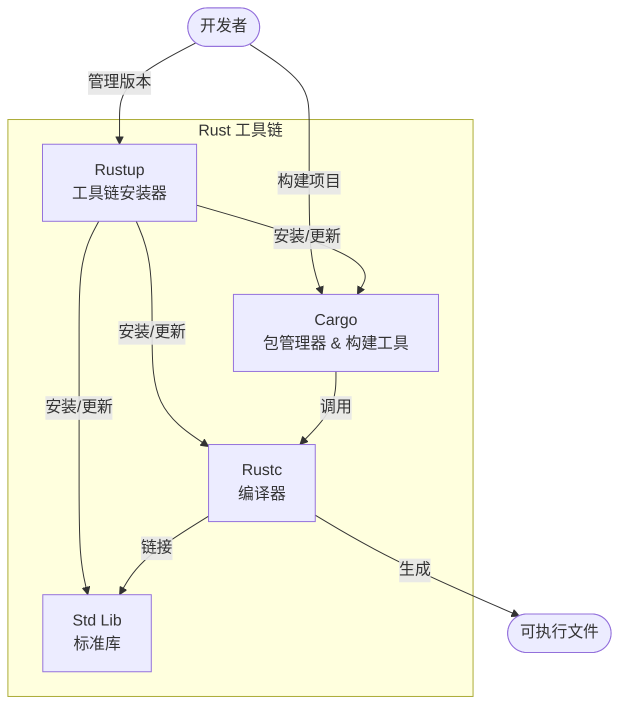
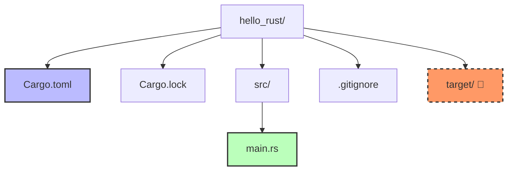

# Day 01: 初识 Rust (Hello Rust)

<p align="center">
  
  <a href="https://doc.rust-lang.org/book/"></a>
</p>

欢迎来到 Rust 的世界！今天我们将迈出成为 Rustacean 的第一步。我们将搭建开发环境，理解 Rust 的工具链，并亲手编写运行第一个 Rust 程序。

## 📝 学习目标 (Learning Objectives)

* **理解核心价值**：明白为什么 Rust 被称为"最受喜爱的编程语言"。
* **掌握环境搭建**：安装并配置 `rustup`, `cargo`, `rustc`。
* **熟悉工具链**：理解 Rust 工具链的组成部分及其作用。
* **编写程序**：使用 `cargo` 创建、编译和运行项目。
* **探索生态**：了解 Crates.io 和 Docs.rs。

---

## 🎯 为什么要学 Rust? (Why Rust?)

Rust 连续多年被 Stack Overflow 开发者评为"最受喜爱的编程语言"，这绝非偶然。它解决了传统系统编程语言（如 C/C++）的痛点，同时提供了现代化的开发体验。

### 1. 🛡️ 内存安全 (Memory Safety)

Rust 最著名的特性。它通过**所有权 (Ownership)** 和 **借用 (Borrowing)** 机制，在编译阶段就消除了空指针、数据竞争和悬空指针等常见的内存错误。最重要的是，它**不需要垃圾回收 (GC)**，这意味着没有运行时暂停。

### 2. ⚡ 极致性能 (Performance)

Rust 是编译型语言，其运行速度媲美 C/C++。它拥有"零成本抽象 (Zero-Cost Abstractions)"的能力——你使用的越高级的抽象，编译后的代码质量并不比手写的底层代码差。

### 3. 🛠️ 现代化工具链 (Modern Toolchain)

不同于 C++ 需要自己配置 Build System (CMake, Make) 和包管理 (Conan, Vcpkg)，Rust 自带的 **Cargo** 提供了世界级的包管理、构建、测试和文档生成体验，开箱即用。

### 4. 🤝 强大的社区与生态 (Community)

从操作系统 (Linux, Windows) 到 WebAssembly，从区块链 (Polkadot, Solana) 到高性能网络服务 (AWS, Cloudflare)，Rust 的应用场景极其广泛。

---

## 📖 核心概念图解 (Core Concepts)

在开始动手之前，让我们先理清 Rust 开发环境的架构。



* **`rustup`**: 你的 Rust 环境管家。负责安装 Rust、切换版本（Stable/Nightly）以及下载标准库源码等组件。
* **`cargo`**: 你的瑞士军刀。负责新建项目、下载依赖、编译代码、运行测试。
* **`rustc`**: 幕后的工匠。实际的编译器，通常由 Cargo 调用，你很少需要直接运行它。

---

## 💻 环境搭建 (Installation)

### Windows / macOS / Linux

官方推荐使用 `rustup` 进行安装。

**macOS / Linux:**

```bash
curl --proto '=https' --tlsv1.2 -sSf https://sh.rustup.rs | sh
```

**Windows:**

1. 下载 [rustup-init.exe](https://win.rustup.rs/)。
2. 运行安装程序，一路回车即可。
3. **注意**：Rust 依赖 C++ 构建环境。如果安装提示缺少 `C++ Build Tools`，请安装 Visual Studio 2022 (勾选 "Desktop development with C++") 或 MinGW。

### ✅ 验证安装

安装完成后，关闭并重新打开终端，输入以下命令检查：

```bash
rustc --version
# 输出示例: rustc 1.75.0 (82e1608df 2023-12-21)

cargo --version
# 输出示例: cargo 1.75.0 (1d8b05cdd 2023-11-20)
```

### 🧩 推荐编辑器插件 (VS Code)

强烈建议使用 **VS Code** 配合 **rust-analyzer** 插件。它提供了极致的代码补全、类型提示和重构功能。

---

## 🚀 Hello World 与 Cargo 项目结构

虽然可以用 `rustc main.rs` 直接编译文件，但在实际开发中，我们**始终使用 Cargo**。

### 1. 创建项目

```bash
cargo new hello_rust
cd hello_rust
```

### 2. 项目结构剖析

Cargo 会自动生成标准的项目结构：



* **`Cargo.toml`**: 项目的配置文件。定义了项目名称、版本以及**依赖库 (Dependencies)**。类似 Node.js 的 `package.json`。
* **`src/main.rs`**: 源代码文件。
* **`Cargo.lock`**: 自动生成的文件，锁定所有依赖的确切版本。**不要手动修改它**。
* **`target/`**: 编译输出目录。包含编译后的二进制文件和中间产物。这个目录通常很大，且会被 Git 忽略。

### 3. 代码解读 (`src/main.rs`)

```rust
fn main() {
    println!("Hello, world!");
}
```

* `fn main() {}`: 程序的入口函数。
* `println!`: 这是一个**宏 (Macro)**，注意末尾的 `!`。宏是 Rust 强大的元编程特性，这里它用于向控制台打印文本。如果它是普通函数，则是 `println` (无感叹号)。

---

## ⚙️ 编译与运行流程 (Compilation Flow)

在 Rust 中，开发循环通常涉及以下命令：


1. **`cargo check`**: 🚀 **最常用**。快速检查代码能否通过编译，但不生成可执行文件。速度极快，适合开发过程中频繁运行。
2. **`cargo run`**: 编译并直接运行程序。
3. **`cargo build`**: 仅编译，生成的可执行文件在 `target/debug/` 下。
4. **`cargo build --release`**: 📦 **发布构建**。开启最高优化级别，编译时间长，但生成的程序运行速度最快。产物在 `target/release/` 下。

---

## � Rust 生态系统 (Ecosystem)

* **[Crates.io](https://crates.io/)**: Rust 的官方包仓库。你可以在这里找到数以万计的第三方库（在 Rust 中称为 **Crate**）。
* **[Docs.rs](https://docs.rs/)**: 文档中心。Crates.io 上托管的所有 Crate 的文档都会自动生成并托管在这里。

---

## 🏋️ 练习题 (Exercises)

我们为你准备了实践练习，帮助你巩固今天的知识。

* **练习 1**: 修正代码并运行
* **练习 2**: 使用 Cargo 创建并配置新项目
* **练习 3**: 探索 Cargo.toml

👉 **[点击这里开始练习](./exercises/README.md)**

---

## 🤔 常见问题 (FAQ)

**Q: 为什么生成的 exe 文件这么大？**
A: Debug 模式下包含了大量调试符号。尝试 `cargo build --release`，并使用 `strip` 命令（Linux/Mac）可以显著减小体积。此外，Rust 默认静态链接标准库，这使得程序在没有安装 Rust 的机器上也能直接运行，但增加了体积。

**Q: `use std::io;` 是什么意思？**
A: 这表示引入标准库 (`std`) 中的 `io` 模块。Rust 默认只引入最常用的一组项（称为 Prelude），其他需要手动引入。

---

## 🔗 扩展阅读

* [Rust 程序设计语言 - 第一章](https://doc.rust-lang.org/book/ch01-00-getting-started.html)
* [Rust by Example - Hello World](https://doc.rust-lang.org/rust-by-example/hello.html)

## ⏭️ 下一步

环境搭建完成，工具链也已就绪。下一节，我们将深入研究 Rust 的基础——变量与数据类型。

[**Day 02: 变量与数据类型**](../02.VariablesAndTypes/README.md)
