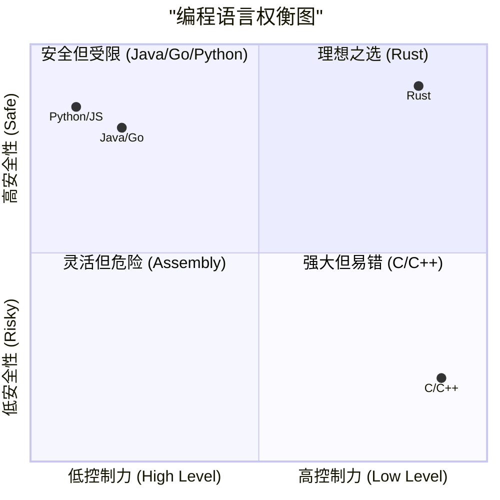
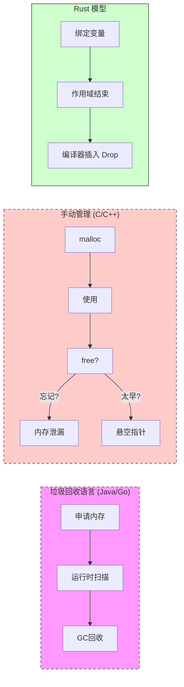
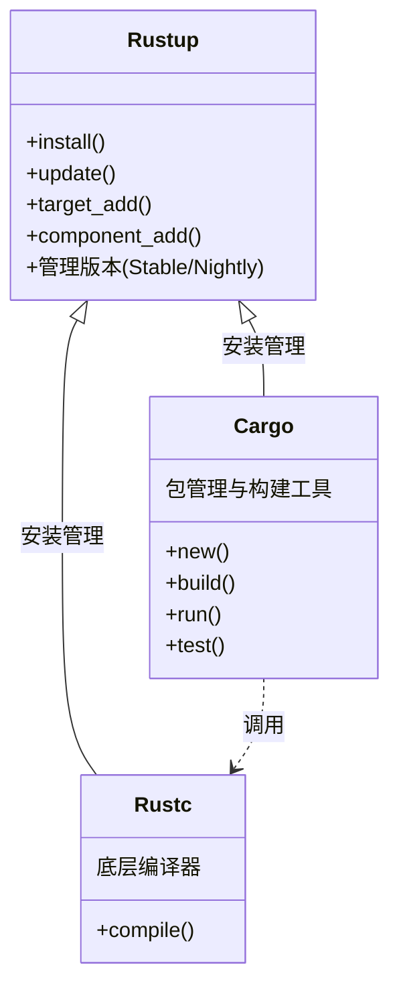
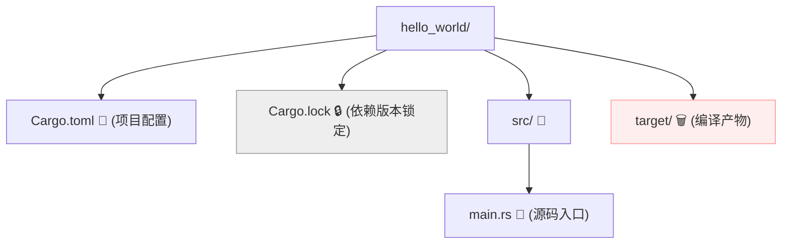
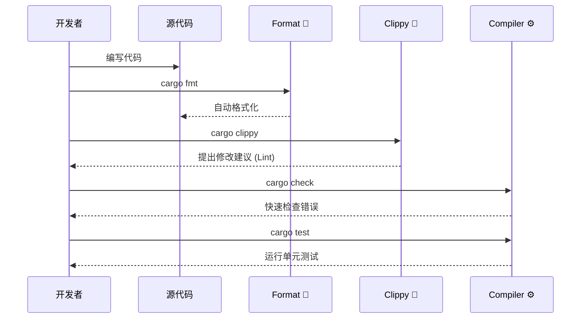

# Day 01: 初识 Rust (Hello Rust)

<p align="center">
  
  <a href="https://doc.rust-lang.org/book/"></a>
  <a href="https://github.com/rust-lang/rust"></a>
</p>

欢迎来到 **Rust 100 Days** 的第一天！今天我们将开启一段从零到精通的系统编程之旅。

本节不仅仅是"Hello World"，我们将深入理解 Rust 的工程化工具链，建立正确的心智模型，并配置一个专业级的开发环境。

---

## 📋 目录 (Table of Contents)

1. [为什么选择 Rust? (Why Rust?)](#-为什么选择-rust-why-rust)
2. [核心概念：所有权与内存安全](#-核心概念所有权与内存安全-core-concepts)
3. [架构预览：Rust 工具链](#-架构预览rust-工具链-toolchain)
4. [环境搭建 (Installation)](#-环境搭建-installation)
5. [第一个 Rust 项目 (Hello World)](#-第一个-rust-项目-hello-world)
6. [专业开发工作流 (Professional Workflow)](#-专业开发工作流-professional-workflow)
7. [生态系统与资源](#-生态系统与资源-resources)
8. [练习与扩展](#-练习与扩展-exercises)

---

## 🎯 为什么选择 Rust? (Why Rust?)

Rust 是一门赋予每个人构建可靠且高效软件能力的系统编程语言。它解决了计算机科学中长久以来的"不可能三角"：**安全**、**并发**与**速度**。

### 语言特性四象限

大多数语言只能在"控制力"和"安全性"之间二选一，而 Rust 打破了这一常规：



1. **🛡️ 内存安全 (Memory Safety)**: 编译期杜绝空指针、数据竞争和缓冲区溢出。无 GC（垃圾回收），却拥有内存即时回收的能力。
2. **⚡ 零成本抽象 (Zero-Cost Abstractions)**: 高级语法（如迭代器、闭包）编译后与手写底层汇编一样快。
3. **🔧 现代工具链**: 拥有业界顶尖的包管理器 (Cargo)、文档生成器和格式化工具。

---

## 🧠 核心概念：所有权与内存安全 (Core Concepts)

Rust 的核心在于**所有权 (Ownership)**。这是 Rust 无需垃圾回收就能保证内存安全的关键。

* **所有权规则**: 每个值都有一个变量作为它的"所有者"。同一时间只能有一个所有者。
* **借用 (Borrowing)**: 类似现实中的"借东西"。你可以借用数据（引用），但必须遵守规则（要么一个可变引用，要么多个不可变引用）。



---

## 🏗️ 架构预览：Rust 工具链 (Toolchain)

你是通过 `rustup` 来管理整个 Rust 宇宙的。



| 组件 | 描述 | 类比 |
| :--- | :--- | :--- |
| **`rustup`** | 安装器、版本管理器 | `nvm` / `pyenv` |
| **`cargo`** | 构建系统、包管理器、测试运行器 | `npm` + `webpack` + `mocha` |
| **`rustc`** | Rust 编译器 | `gcc` / `clang` / `javac` |
| **`std`** | 标准库 | Python Standard Lib |

---

## 💻 环境搭建 (Installation)

### 1. 安装 Rust

**Unix (macOS / Linux):**

```bash
curl --proto '=https' --tlsv1.2 -sSf https://sh.rustup.rs | sh
```

**Windows:**

1. 下载 [rustup-init.exe](https://win.rustup.rs/)。
2. 安装 **Visual Studio 2022** 的 "Desktop development with C++" 工作负载（这是因为 Windows 版本的 Rust 依赖 MSVC链接器）。

### 2.配置镜像 (可选，推荐国内用户)

为了加速下载，配置字节跳动或清华源：
在 `~/.cargo/config.toml` (Linux/Mac) 或 `%USERPROFILE%\.cargo\config.toml` (Windows) 中添加：

```toml
[source.crates-io]
replace-with = 'rsproxy'

[source.rsproxy]
registry = "https://rsproxy.cn/crates.io-index"
[source.rsproxy-sparse]
registry = "sparse+https://rsproxy.cn/index/"

[registries.crates-io]
protocol = "sparse"
```

### 3. 验证安装

```bash
rustc --version
# rustc 1.75.0 (...)
cargo --version
# cargo 1.75.0 (...)
```

---

## 🚀 第一个 Rust 项目 (Hello World)

我们不直接调用 `rustc`，而是始终使用 `cargo`。

### 创建与运行

```bash
cargo new hello_world
cd hello_world
cargo run
```

### 项目结构剖析

Cargo 创建了一个标准的工程结构：



* **Cargo.toml**: 清单文件。定义依赖 (dependencies)。
* **Cargo.lock**: **不要手动修改！** 它确保你的同事和服务器使用完全一致的依赖版本。
* **target/**: 很大，包含构建产物。应加入 `.gitignore`。

### 代码解读 (`main.rs`)

```rust
fn main() {
    println!("Hello, World!");
}
```

* `fn`: 定义函数 (Function)。
* `main`: 程序入口。
* `println!`: 注意那个 **!**。这代表它是一个 **宏 (Macro)**，而不是普通函数。宏在编译时展开代码，更加强大灵活。

---

## ⚙️ 专业开发工作流 (Professional Workflow)

作为一个专业的 Rustacean，你的日常不仅仅是 `build`。Rust 提供了全套内置工具。



### 常用命令清单

| 命令 | 作用 | 场景 |
| :--- | :--- | :--- |
| `cargo new <name>` | 创建新项目 | 开始新工作 |
| `cargo check` | **最常用**。快速语法检查，不生成二进制 | 编码过程中频繁运行 (快!) |
| `cargo build` | 编译 (Debug模式) | 调试运行 |
| `cargo build --release` | 编译 (Release模式) | 生产环境发布 (开启最高优化) |
| `cargo run` | 编译并运行 | 本地测试 |
| `cargo fmt` | 格式化代码 | 保持代码风格统一 |
| `cargo clippy` | linter 工具 | 获取优化代码的建议 |
| `cargo doc --open` | 生成并打开文档 | 查看依赖库的文档 |

> **💡 提示**: `cargo check` 比 `cargo build` 快得多。养成随手 `check` 的习惯。

---

## 🌍 生态系统与资源 (Resources)

* **[Crates.io](https://crates.io/)**: Rust 的 NPM/PyPI。官方包仓库。
* **[Docs.rs](https://docs.rs/)**: 所有 Crates 的文档中心。
* **[Rust Standard Library](https://doc.rust-lang.org/std/)**: 标准库文档，你的红宝书。
* **[The Rust Programming Language](https://doc.rust-lang.org/book/)**: 官方教材 ("The Book")。

### 推荐 VS Code 插件

1. **rust-analyzer**: 官方核心插件，提供极强的代码补全和分析。
2. **CodeLLDB** (macOS/Linux) / **C/C++** (Windows):用于调试。
3. **Even Better TOML**: 支持编辑 `Cargo.toml`。
4. **Crates**: 显示依赖项的最新版本。

---

## 🏋️ 练习与扩展 (Exercises)

光看不练假把式。请完成以下练习：

1. **环境体检**: 运行 `cargo fmt` 和 `cargo clippy` 在你的 Hello World 项目上，看看会发生什么。
2. **配置尝鲜**: 修改 `Cargo.toml`，添加一个依赖（例如 `ferris-says = "0.2"`），然后在 `main.rs` 中使用它。
3. **文档探索**: 运行 `cargo doc --open` 查看自动生成的文档。

👉 **[点击这里访问详细练习题目录](./exercises/README.md)**

---

## ⏭️ 下一步

一旦你的环境准备就绪，我们就可以开始真正的编程了。下一章我们将学习 Rust 最基础的构建块。

[**Day 02: 变量与数据类型 (Variables & Types)**](../02.VariablesAndTypes/README.md)
