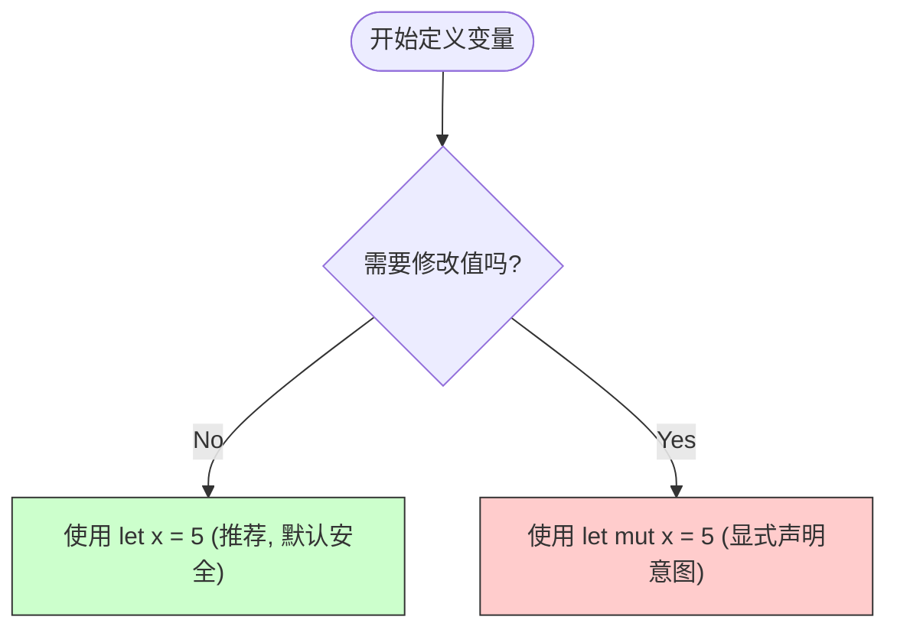
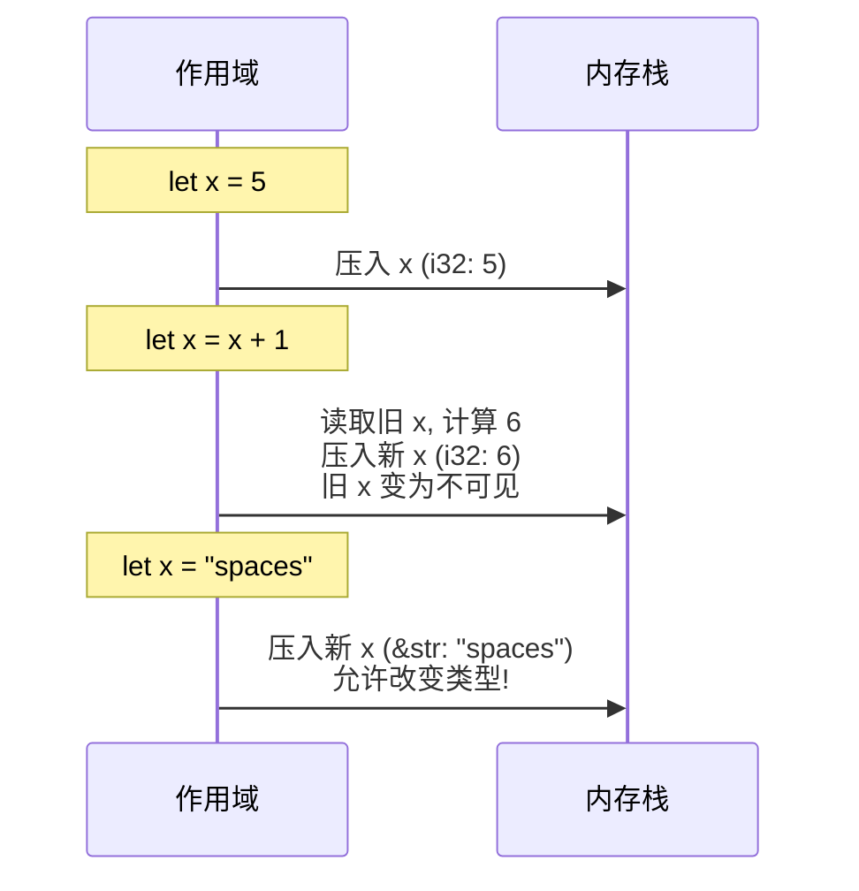
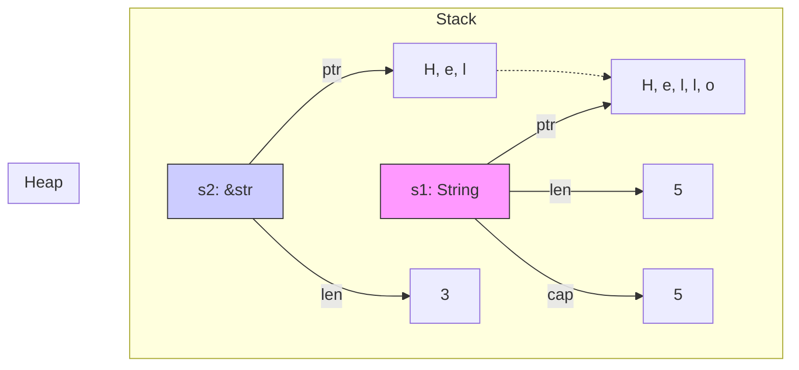

# Day 02: 变量与数据类型 (Variables & Types)

欢迎来到 **Rust 100 Days** 的第二天！今天我们将探讨 Rust 的"法律与秩序"：**严格的类型系统**与**所有权规则的雏形**。

在 Rust 中，变量不仅仅是存储数据的容器，它们还承载着关于"可变性"和"生命周期"的契约。

---

## 📋 目录 (Table of Contents)

1. [核心哲学：默认不可变 (Immutability)](#-核心哲学默认不可变-immutability)
2. [变量的艺术：可变性与隐藏 (Mutability & Shadowing)](#-变量的艺术可变性与隐藏-mutability--shadowing)
3. [Rust 类型系统全景图 (Type System)](#-rust-类型系统全景图-type-system)
4. [基础类型详解 (Primitives)](#-基础类型详解-primitives)
5. [复合类型详解 (Compound Types)](#-复合类型详解-compound-types)
6. [专业编码习惯 (Professional Habits)](#-专业编码习惯-professional-habits)
7. [练习与扩展](#-练习与扩展-exercises)

---

## �️ 核心哲学：默认不可变 (Immutability)

在其他语言中，变量往往默认是可变的（如 JS 的 `var/let`, Python, C++）。但在 Rust 中，变量**默认不可变**。

### 为什么这样设计？

1. **安全性 (Safety)**: 如果一个值不可变，你就永远不用担心它在你不注意的时候被修改了。
2. **并发 (Concurrency)**: 多线程同时读取不可变数据是绝对安全的，不需要加锁。
3. **编译器优化**: 编译器可以对不可变数据做更多优化。



---

## 🎨 变量的艺术：可变性与隐藏 (Mutability & Shadowing)

### 1. 可变变量 (`mut`)

当你必须修改变量时，使用 `mut` 关键字。

```rust
let mut x = 5;
println!("The value of x is: {}", x);
x = 6; // ✅ 合法
println!("The value of x is: {}", x);
```

### 2. 常量 (`const`)

常量是**总是不可变**的。这与 `let` 不可变变量不同：

* 必须标注类型。
* 只能设置为常量表达式，不能是函数调用的结果。
* 在编译期直接替换到用到它的地方。

```rust
const MAX_POINTS: u32 = 100_000;
```

### 3. 隐藏 (Shadowing) - Rust 的"忍术"

这是 Rust 特有的强大特性。你可以使用 `let` 再次声明同名变量。这**不是**修改旧变量，而是**创建了一个新变量**，并"遮盖"了旧的。



**Shadowing vs Mutability**

* **Shadowing (Let x ... Let x)**: 创建新变量，**可以改变类型**。
* **Mutability (Let mut x ... x = )**: 修改同一变量，**不能改变类型**。

---

## 🌳 Rust 类型系统全景图 (Type System)

Rust 是**静态强类型**语言。也就是在编译期必须知道所有变量的类型。

```mermaid
classDiagram
    class Type {
        <<Rust Types>>
    }
    class Scalar["标量类型"] {
        代表单一值
    }
    class Compound["复合类型"] {
        组合多个值
    }
    
    Type <|-- Scalar
    Type <|-- Compound
    
    Scalar <|-- Integer["整数"]
    Scalar <|-- Float["浮点"]
    Scalar <|-- Boolean["布尔"]
    Scalar <|-- Char["字符"]
    
    Compound <|-- Tuple["元组"]
    Compound <|-- Array["数组"]
```

---

## 🧱 基础类型详解 (Primitives)

### 1. 整数 (Integer)

| 长度 | 有符号 (Signed) | 无符号 (Unsigned) | 场景 |
| :--- | :--- | :--- | :--- |
| 8-bit | `i8` | `u8` | 字节流, 文件 IO |
| 32-bit | `i32` (**默认**) | `u32` | 一般数字 |
| 64-bit | `i64` | `u64` | 大数 |
| Arch | `isize` | `usize` | 索引, 指针大小 |

> **⚠️ 关于溢出**: 在 Debug 模式下，整数溢出会导致程序 Panic (崩溃)。在 Release 模式下，Rust 会执行二进制补码环绕 (Wrapping) 而不是 Panic。

### 2. 浮点数 (Floating-Point)

* `f64` (**默认**): 双精度，速度与 f32 几乎一样，但在现代 CPU 上精度更高。
* `f32`: 单精度，用于极度节省内存或特定图形计算。

### 3. 布尔与字符

* `bool`: `true` 或 `false`. (1 字节)
* `char`: 代表一个 **Unicode 标量值**。它是 4 字节的！这意味着它可以存储中文、Emoji (`😻`) 等。**注意使用单引号** `' '`。

---

## 📦 复合类型详解 (Compound Types)

### 1. 元组 (Tuple)

将多个**不同类型**的值组合在一起。长度固定。

```rust
let tup: (i32, f64, u8) = (500, 6.4, 1);
let (x, y, z) = tup; // 解构 (Destructuring)
let five_hundred = tup.0; // 点号索引
```

### 2. 数组 (Array)

将多个**相同类型**的值组合在一起。**长度固定**，分配在**栈 (Stack)** 上。

```rust
// 类型: [i32; 5] -> [类型; 本数]
let a = [1, 2, 3, 4, 5]; 

// 初始化语法：5 个 3
let a = [3; 5]; // [3, 3, 3, 3, 3]
```

> **🤔 什么时候用数组？**: 当你知道元素个数确定不变时（如一年 12 个月）。如果你需要动态增删元素，请使用 **Vector** (`Vec<T>`)（后续章节介绍）。

### 3. 文本类型 (Text Types) - 深入解析

Rust 的字符串处理与 C++ 或 Java 不同，它非常关注内存安全和编码。最常见的两种类型是 `String` 和 `str` (通常以 `&str` 形式出现)。

#### 3.1 核心区别：所有权与内存布局

* **String (字符串对象)**:
  * **本质**: 被封装的 `Vec<u8>`。
  * **特点**: 拥有所有权、可变 (`mut`)、堆上分配、可动态增长。
  * **结构**: 栈上存储 3 个字长：`ptr` (指针), `len` (长度), `capacity` (容量)。

* **&str (字符串切片/引用)**:
  * **本质**: 对一段 UTF-8 数据的引用/视图。
  * **特点**: 借用 (无所有权)、不可变、大小固定。
  * **结构**: 栈上存储 2 个字长：`ptr` (指针), `len` (长度)。也被称为"胖指针" (Fat Pointer)。



#### 3.2 什么时候用哪个？

| 特性 | String | &str |
| :--- | :--- | :--- |
| **内存位置** | 堆 (Heap) (内容) | 任意 (堆, 栈, 静态区) |
| **所有权** | 拥有数据 | 借用数据 |
| **可变性** | 可变 (需 `mut`) | 不可变 |
| **开销** | 分配内存 (慢) | 零拷贝 (快) |
| **典型场景** | 存储数据, 结构体成员, 返回值 | 函数参数, 临时视图 |

#### 3.3 常用操作

**1. 创建与转换**

```rust
// 创建 String
let s1 = String::from("Hello");
let s2 = "World".to_string();
let s3 = String::new(); // 空字符串

// String -> &str (借用)
let slice = &s1;       // 自动解引用
let slice2 = s1.as_str();

// &str -> String (复制/分配)
let clone = slice.to_string();
```

**2. 修改 (需要 String + mut)**

```rust
let mut s = String::from("Hello");
s.push(' ');       // 追加字符
s.push_str("Rust"); // 追加字符串切片
// s 现在是 "Hello Rust"
```

**3. 格式化拼接**

使用 `format!` 宏不仅清晰，而且不会像 `+` 运算符那样涉及复杂的所有权转移。

```rust
let s1 = String::from("Tic");
let s2 = String::from("Tac");
let s3 = String::from("Toe");

let s = format!("{}-{}-{}", s1, s2, s3); 
// s -> "Tic-Tac-Toe"
// s1, s2, s3 依然有效
```

> **⚠️ UTF-8 警告**: Rust 的字符串总是合法的 **UTF-8** 序列。
> 这意味着在 Rust 中，`"你好".len()` 是 **6** (每个汉字 3 字节)，而不是 2。
> **千万不要**直接用索引访问字符串 (如 `s[0]`)，因为这可能会切断一个宽字符导致报错。如果要遍历字符，请使用 `.chars()` 方法。

---

## 🧢 专业编码习惯 (Professional Habits)

1. **命名规范**:
    * 变量、函数: `snake_case` (如 `user_id`, `calculate_sum`)
    * 常量: `SCREAMING_SNAKE_CASE` (如 `MAX_RETRY`)
    * 类型: `UpperCamelCase` (如 `String`, `TcpStream`)
2. **类型注解**: 虽然编译器很聪明，但在定义稍微复杂的类型时，手动写上类型注解有助于可读性。
3. **未使用变量**: 如果你声明了一个变量但还没想好怎么用，Rust 编译器会给警告。在变量名前加 `_` (如 `_x`) 可以消除警告。
4. **数字字面量**: 使用下划线增加可读性。`1_000_000` 比 `1000000` 清晰得多。

---

## 🏋️ 练习与扩展 (Exercises)

动手时间！

1. **类型转换**: 尝试将 `i32` 转换为 `i64`？(提示: 使用 `as` 关键字)
2. **数组越界**: 创建一个长度为 5 的数组，尝试访问索引 10，观察编译期和运行时的行为。
3. **Shadowing 魔法**: 利用 Shadowing 将一个字符串类型的数字 (`"42"`) 转换为整数类型 (`42`)。

👉 **[点击这里访问详细练习题目录](./exercises/README.md)**

---

## ⏭️ 下一步

掌握了数据的形态，接下来我们要让数据"动"起来。下一章，我们将学习如何组织代码流程。

[**Day 03: 函数与控制流 (Functions & Control Flow)**](../03.FunctionsAndControlFlow/README.md)
