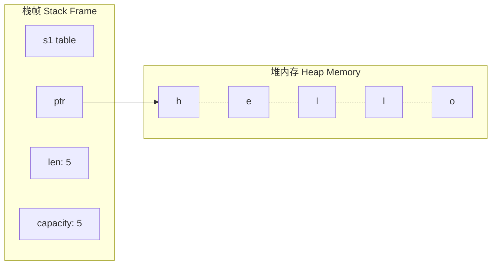
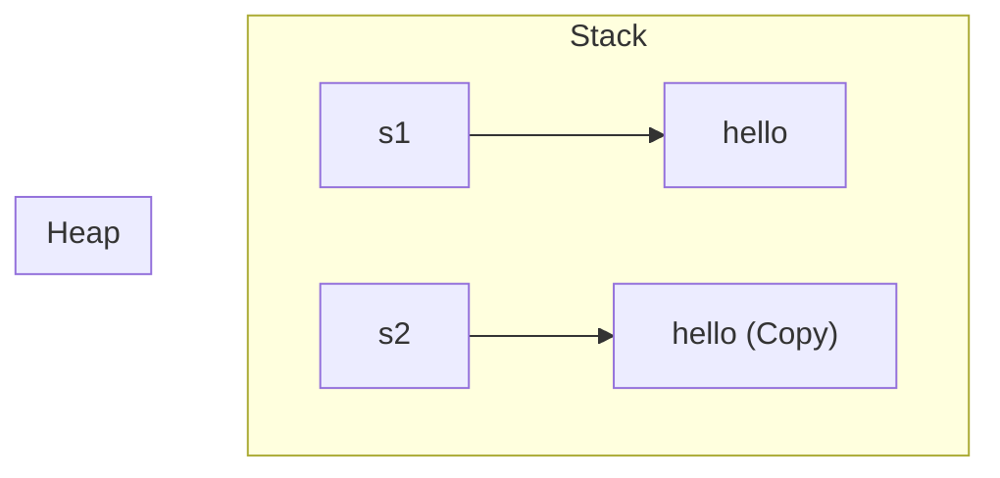

# Day 04: 所有权 (Ownership)

## 📝 学习目标

- 深层理解 Stack (栈) 与 Heap (堆) 的工作原理与区别
- 彻底掌握所有权 (Ownership) 三大原则
- 理解内存回收机制 (Scope & Drop)
- 掌握 移动 (Move)、克隆 (Clone) 与 拷贝 (Copy) 的底层语义
- 能够识别并修复常见的所有权编译错误

## 🎯 核心概念：为什么需要所有权？

所有程序都需要管理其运行时使用的计算机内存。现有的编程语言主要采用两种方式：

1. **垃圾回收机制 (GC)**：如 Java, Python, Go。程序运行时不断寻找不再使用的内存并释放。
    - *优点*：开发简单。
    - *缺点*：运行时开销 (Stop-the-world)，不可预测的性能。
2. **手动分配释放**：如 C, C++。程序员显式申请 (`malloc/new`) 和释放 (`free/delete`) 内存。
    - *优点*：控制力强，性能极高。
    - *缺点*：容易内存泄漏 (Memory Leak) 或双重释放 (Double Free)，导致安全漏洞。

**Rust 选择了第三种方式：所有权系统**。
内存管理通过一套编译器在编译时检查的规则进行管理。**运行时没有任何额外开销**。

---

## 📚 预备知识：栈 (Stack) 与 堆 (Heap)

理解所有权之前，必须先理清栈与堆的区别。

| 特性 | 栈 (Stack) | 堆 (Heap) |
| :--- | :--- | :--- |
| **组织方式** | 后进先出 (LIFO)，像一摞盘子 | 只有指针在栈上，数据在内存中无序存放 (类似餐厅找空桌子) |
| **大小** | 编译时已知且固定 | 运行时动态变化 |
| **速度** | **极快** (无需寻找空间，直接压栈) | **较慢** (需要分配器寻找足够大的空间并标记) |
| **访问** | 极快 (局部性好) | 较慢 (需要通过指针跳转) |
| **典型数据** | `i32`, `bool`, `char`, 固定数组 | `String`, `Vec`, 复杂对象 |

> 💡 **Rust 的性能秘密**：尽量在栈上分配数据，减少堆分配是 Rust 高性能的关键之一。

---

## 🛡️ 所有权规则 (The Rules)

这是 Rust 内存管理的宪法，必须牢记：

1. **Rust 中的每一个值都有一个被称为其 所有者 (Owner) 的变量。**
2. **值在任一时刻有且只有一个所有者。**
3. **当所有者 (变量) 离开作用域 (Scope) 时，这个值将被丢弃 (Dropped)。**

### 作用域 (Scope) 示意

```rust
{                      // s 在这里无效，它还没声明
    let s = "hello";   // s 从这里开始有效
                       // 使用 s
}                      // 此作用域结束，s 不再有效，内存被释放
```

---

## 🧠 内存布局与移动语义 (Move)

### 1. 变量绑定背后的内存 (String 为例)

`String` 类型由三部分组成，存储在 **栈** 上：

1. `ptr`: 指向存放字符串内容的堆内存指针
2. `len`: 当前字符串长度 (字节)
3. `capacity`: 堆内存总容量

实际的字符串内容 ("hello") 存储在 **堆** 上。



### 2. 移动 (Move): Rust 的默认行为

当我们把 `s1` 赋值给 `s2` 时：

```rust
let s1 = String::from("hello");
let s2 = s1; // ⚠️ 这里发生了移动 (Move)
// println!("{}", s1); // ❌ 错误！s1 已经失效
```

**发生了什么？**
Rust **不会** 复制堆上的数据（那样太慢）。Rust 只是拷贝了栈上的元数据 (`ptr`, `len`, `cap`)。
为了保证 **规则 #2 (同一时间只有一个所有者)** 和防止 **Double Free (二次释放)**，Rust 视 `s1` 为无效。

```mermaid
graph LR
    subgraph Stack
        s1[s1 (Invalidated)] -.-> heap_data
        s2[s2 (New Owner)] --> heap_data
    end
    
    subgraph Heap
        heap_data["h | e | l | l | o"]
    end
    
    style s1 fill:#ffcccc,stroke:#ff0000,stroke-dasharray: 5 5
    style s2 fill:#ccffcc,stroke:#00ff00
```

这被称为 **Move (移动)**，而不是浅拷贝 (Shallow Copy)。因为旧变量失效了。

---

## 🧬 克隆 (Clone) 与 拷贝 (Copy)

### 1. 克隆 (Clone): 深度复制

如果你确实需要两个独立的堆数据副本，必须显式调用 `.clone()`。

```rust
let s1 = String::from("hello");
let s2 = s1.clone(); // ✅ 堆数据被真正复制了
println!("s1 = {}, s2 = {}", s1, s2);
```

**内存布局**：



### 2. 拷贝 (Copy): 栈上的自动复制

对于像整型这样完全存储在栈上的类型，没有“深浅拷贝”之分。复制非常快，Rust 默认允许这种行为。

```rust
let x = 5;
let y = x; // 自动 Copy
println!("x = {}, y = {}", x, y); // ✅ x 依然有效
```

**哪些类型是 `Copy` 的？**

- 所有整数类型 (`u32`, `i32`...)
- 布尔类型 (`bool`)
- 浮点数 (`f64`)
- 字符类型 (`char`)
- 元组 (当且仅当其包含的类型也都是 `Copy` 的，如 `(i32, i32)`)

> ⚠️ 注意：`String` 不是 Copy 的，`Vec` 不是 Copy 的。任何需要分配堆内存的类型通常都不是 Copy 的。

---

## 🤝 函数与所有权

将值传递给函数，语义与赋值语句一样：要么是 **移动 (Move)**，要么是 **拷贝 (Copy)**。

```rust
fn main() {
    let s = String::from("hello");  // s 进入作用域
    
    takes_ownership(s);             // s 的值移动进入函数
                                    // ... 所以这里不再有效
    // println!("{}", s);           // ❌ 编译错误

    let x = 5;                      // x 进入作用域
    makes_copy(x);                  // x 应该移动进入函数，
                                    // 但 i32 是 Copy，所以后面可继续使用 x
} // 这里：x 移出作用域。s 的值已被移动，所以不会对 s 做任何操作。

fn takes_ownership(some_string: String) { // some_string 进入作用域
    println!("{}", some_string);
} // some_string 移出作用域，`drop` 被调用。内存释放。

fn makes_copy(some_integer: i32) { 
    println!("{}", some_integer);
}
```

### 返回值与作用域

函数返回值也可以转移所有权。

```rust
fn main() {
    let s1 = gives_ownership();         // gives_ownership 将返回值移动给 s1
    let s2 = String::from("hello");     // s2 进入作用域
    let s3 = takes_and_gives_back(s2);  // s2 被移动到函数，
                                        // 函数也将返回值移动给 s3
} 

fn gives_ownership() -> String {
    let some_string = String::from("yours");
    some_string // 返回 some_string，并移出给调用函数
}

fn takes_and_gives_back(a_string: String) -> String { 
    a_string  // 原样返回
}
```

---

## 🚫 常见陷阱：部分移动 (Partial Move)

在解构复杂类型时，要小心部分字段被移动。

```rust
struct User {
    username: String,
    active: bool,
}

let user1 = User { 
    username: String::from("someone"), 
    active: true 
};

let name = user1.username; // hex: username 被移动走了！

// println!("{}", user1.username); // ❌ 错误：user1.username 已无效
println!("{}", user1.active);      // ✅ 正确：active 是 Copy 类型 (bool)
// ⚠️ 此时整个 user1 变量不能再作为一个整体被使用了
```

---

## 💡 最佳实践

1. **拥抱 Move**：不要因为害怕 Move 而到处 Clone。Move 是高效且安全的，习惯它。
2. **理解生命周期**：脑海中要时刻跟踪变量何时产生，何时离开作用域。
3. **引用代替所有权转移**：如果不想交出所有权，请使用 **引用 (Reference)** (下一节内容)。

---

## 🏋️ 练习题

👉 **[点击这里查看练习题](./exercises/README.md)**

1. **修复所有权错误**：识别 Move 发生的位置并修复。
2. **实现 Clone**：手动克隆数据以保留原值。
3. **Drop 顺序**：观察变量离开作用域时的清理顺序。

---

## ⏭️ 下一步

如果每次函数调用都要把所有权“借出去”再“还回来”太麻烦了。有没有办法访问数据但不获取所有权？
答案是有的。

下一节: [Day 05: 引用与借用 (References & Borrowing)](../05.ReferencesAndBorrowing/README.md)
