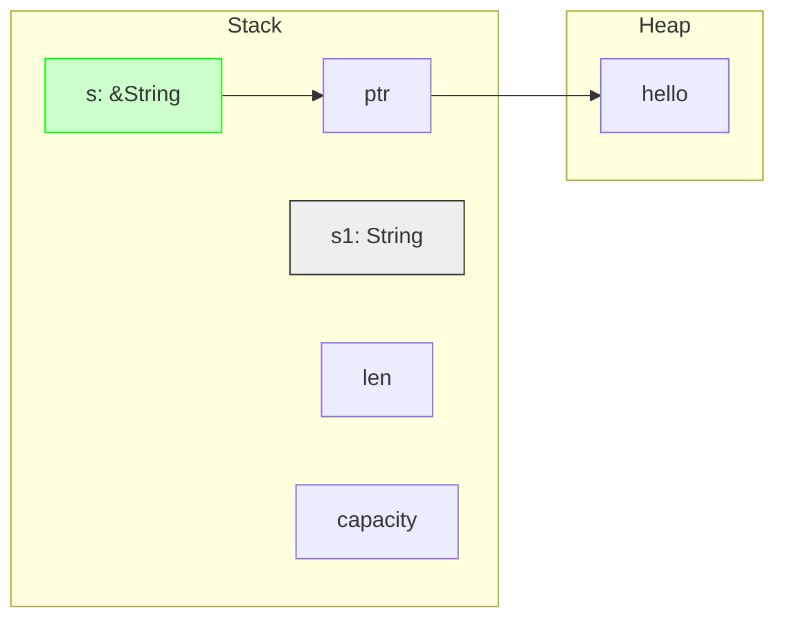

# Day 05: 引用与借用 (References and Borrowing)

## 📝 学习目标

- 理解 **引用 (Reference)** 的底层内存模型
- 彻底掌握 **借用 (Borrowing)** 的两大核心规则
- 区分 **不可变引用** (`&T`) 和 **可变引用** (`&mut T`)
- 理解 **数据竞争 (Data Race)** 及其预防机制
- 识别 **悬垂引用 (Dangling References)**

## 🎯 为什么要学这个？

在 Day 04 中，我们发现所有权转移（Move）虽然安全，但有时很麻烦：

1. **麻烦的归还**：传入函数的变量，如果不手动返回，外面就不能用了。
2. **性能开销**：如果为了保留原值而频繁 `Clone`，性能会很差。

**引用 (Reference)** 允许我们使用值而不获取其所有权。
> **比喻**：引用就像是"租借"。你借了一本书（引用），你有权看（读），甚至经允许可以做笔记（写），但你不能把书卖了（Move）或者烧了（Drop），因为书的主人不是你。

---

## 🏗️ 核心概念：引用的本质

**引用** 是一个地址（指针），它指向了内存中属于其他人的数据。
**解引用** (`*`) 是通过指针访问数据的操作。

```rust
let x = 5;
let y = &x; // y 是 x 的引用
// *y 等于 5
```

### 内存布局示意图

假设 `s1` 是一个 `String`，`s` 是 `&s1`。



- `s1` 拥有堆数据。
- `s` 仅仅是指向 `s1` 的指针。
- 当 `s` 离开作用域，**不会** 触发堆数据的 drop，因为它不拥有所有权。

---

## ⚖️ 引用类型对比

Rust 有两种引用，对应两种借用方式：

| 特性 | 不可变引用 (`&T`) | 可变引用 (`&mut T`) |
| :--- | :--- | :--- |
| **符号** | `&` | `&mut` |
| **所有权** | 无 | 无 |
| **权限** | **只读** (Read-Only) | **读写** (Read-Write) |
| **数量限制** | 任意多个 | **同一时间只能有一个** |
| **比喻** | 很多人同时看一张只读的公告牌 | 只有一个人拿着笔在修改白板 |

---

## 🛡️ 借用规则 (The Rules of Borrowing)

这是 Rust 编译器 (Borrow Checker) 最核心的检查逻辑，必须背诵：

1. **在任意给定时间，你要么只能有一个可变引用，要么只能有多个不可变引用。** (不能同时存在)
2. **引用必须总是有效的。** (不能是悬垂指针)

### 为什么要有规则 1？防止数据竞争 (Data Race)

数据竞争会导致未定义的行为，非常难以调试。它发生在：

1. 两个或更多指针同时访问同一数据。
2. 至少有一个指针被用来写入数据。
3. 没有同步数据的机制。

Rust 在编译阶段就杜绝了这种情况！

---

## 💻 代码实战

### 场景 1: 不可变借用 (只读)

```rust
fn main() {
    let s1 = String::from("hello");
    let len = calculate_length(&s1); // 把引用传进去
    println!("The length of '{}' is {}.", s1, len); // s1 依然有效！
}

fn calculate_length(s: &String) -> usize { // s 是引用
    s.len()
} // s 离开作用域，因为没有所有权，什么也不会发生
```

### 场景 2: 可变借用 (读写)

```rust
fn main() {
    let mut s = String::from("hello"); // 必须是 mut 变量才能创建 mut 引用
    change(&mut s);
    println!("{}", s); // 输出 "hello, world"
}

fn change(some_string: &mut String) {
    some_string.push_str(", world"); // 可以修改
}
```

### 场景 3: 违反借用规则 (编译错误)

```rust
let mut s = String::from("hello");

let r1 = &s; // no problem
let r2 = &s; // no problem
let r3 = &mut s; // ❌ 错误！不能在拥有不可变引用的同时创建可变引用

// println!("{}, {}, and {}", r1, r2, r3); 
```

> **错误原因**：`r1` 和 `r2` 期望数据不变，但 `r3` 随时可能修改数据。这破坏了 `r1` 和 `r2` 的预期。

---

## 🧟 悬垂引用 (Dangling References)

在 C++ 中，很容易返回一个指向栈上局部变量的指针，函数结束后该变量释放，指针指向无效内存。
**Rust 编译器保证永远不会出现悬垂引用**。

```rust
fn main() {
    let reference_to_nothing = dangle();
}

fn dangle() -> &String { // 试图返回引用
    let s = String::from("hello"); // s 是新创建的
    &s // 返回 s 的引用
} // ❌ s 离开作用域被 drop，内存释放
  // 返回的引用指向了无效内存！Rust 会阻止编译。
```

**解决方案**：直接返回 String (转移所有权)，而不是引用。

```rust
fn no_dangle() -> String {
    let s = String::from("hello");
    s
}
```

---

## 🔬 引用的作用域 (NLL)

自 Rust 1.31 起，引用的作用域不仅仅是花括号 `{}`，而是 **从声明开始，到最后一次使用结束**。这被称为 **Non-Lexical Lifetimes (NLL)**。

```rust
let mut s = String::from("hello");

let r1 = &s; 
let r2 = &s;
println!("{} and {}", r1, r2);
// r1 和 r2 的作用域在这里就结束了！因为后面没再用过它们。

let r3 = &mut s; // ✅ 现在可以了！因为 r1/r2 已经"死"了
println!("{}", r3);
```

---

## 💡 最佳实践

1. **默认不可变**：优先使用 `&T`，只有在确实需要修改时才用 `&mut T`。
2. **显式解引用**：虽然 `.` 操作符会自动解引用，但在做数值运算或赋值时，别忘了 `*`。

    ```rust
    let mut x = 10;
    let r = &mut x;
    *r += 5; // 显式解引用来修改值
    ```

3. **理解借用检查器是朋友**：它虽然有时很烦人，但它在帮你避免很难调试的并发 Bug。

---

## 🏋️ 练习题

👉 **[点击这里查看练习题](./exercises/README.md)**

1. **修复多重借用**：解决同时存在可变和不可变引用的错误。
2. **生命周期初探**：理解引用为何失效。
3. **解引用操作**：练习使用 `*` 读写数据。

---

## ⏭️ 下一步

如果我们只想引用字符串的一部分（比如 "hello world" 中的 "hello"）怎么办？创建一个新的 String 太浪费了。
Rust 提供了 **切片 (Slice)** 来解决这个问题。

下一节: [Day 06: 切片类型 (Slices)](../06.Slices/README.md)
