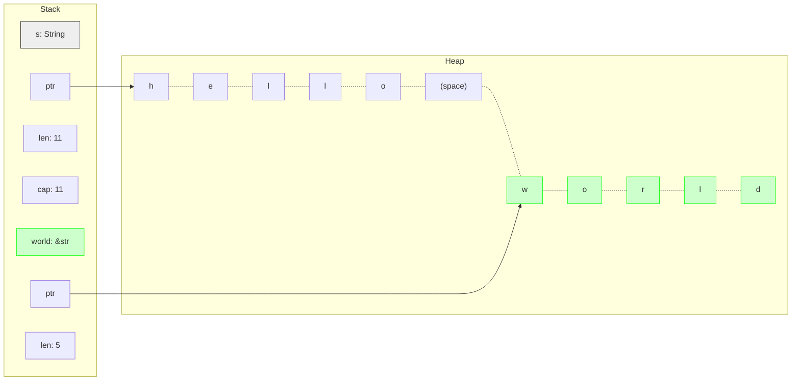
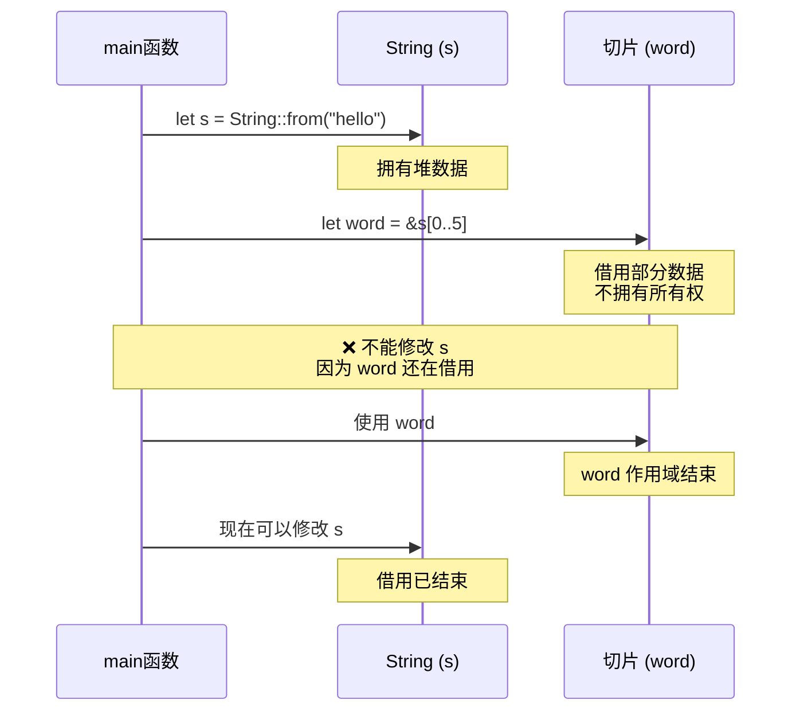

# Day 06: 切片 (Slices)

## 📝 学习目标

- 理解 **切片 (Slice)** 的底层内存结构 (`ptr` + `len`)
- 熟练使用 `Range` 语法 (`..`) 创建切片
- 掌握 **字符串切片** (`&str`) 与 `String` 的区别
- 理解为什么 **字符串字面值** 是切片
- 了解数组切片及其在参数传递中的优势

## 🎯 核心概念：什么是切片？

切片引用了集合中 **一段连续的元素序列**，而不是引用整个集合。
切片是一类 **引用**，所以它 **没有所有权**。

> **比喻**：如果是 `String` 是一整块面包，那么切片 (`&str`) 就是这块面包上切下来的一片。你不能拥有这片面包（它还连在整块上），但你可以看它、闻它。

---

## 🧠 内存模型：切片长什么样？

切片是一个 **胖指针 (Fat Pointer)**，它包含两部分信息，存储在栈上：

1. **指针 (ptr)**：指向切片起始位置的数据。
2. **长度 (len)**：切片包含多少个元素（或字节）。

### 字符串切片图解

假设我们有一个 `String`：`let s = String::from("hello world");`
我们创建一个切片：`let world = &s[6..11];`



**解释**：

- `s` 拥有整个堆数据。
- `world` 在栈上，它的指针指向堆内存的第 6 个字节，长度为 5。

---

## ✂️ 语法：Range (范围)

Rust 使用 `..` 语法来表示范围。

| 语法 | 说明 | 等价数学表达 |
| :--- | :--- | :--- |
| `0..5` | 从 0 开始，到 5 结束 (不含 5) | $[0, 5)$ |
| `0..=4` | 从 0 开始，到 4 结束 (包含 4) | $[0, 4]$ |
| `..2` | 从头开始，到 2 结束 | $[0, 2)$ |
| `3..` | 从 3 开始，直到最后 | $[3, len)$ |
| `..` | **全切片**：引用整个集合 | $[0, len)$ |

```rust
let s = String::from("hello");
let len = s.len();

let slice1 = &s[0..2]; // "he"
let slice2 = &s[..2];  // "he" (简写)
let slice3 = &s[3..];  // "lo"
let slice4 = &s[..];   // "hello" (完整切片)
```

---

## 🧵 字符串切片 (`&str`)

类型标识：`&str` (读作 "string slice")。

### 为什么字符串字面值不可变？

```rust
let s = "Hello, world!";
```

这里的 `s` 的类型就是 `&str`。它指向了编译后二进制文件的数据区。因为二进制文件在运行时不可修改，所以字面值永远是不可变的。

### ⚠️ 危险：UTF-8 字符边界

Rust 的 `String` 是 UTF-8 编码的。一个字符（如中文）可能占用 3 个字节。
**如果你切在个字符的中间，程序会崩溃 (Panic)！**

```rust
let s = "你好";
// "你" 占 3 字节，"好" 占 3 字节。总长 6。

// let w = &s[0..1]; 
// ❌ 运行时 Panic! 
// 错误信息：byte index 1 is not a char boundary; it is inside '你' (bytes 0..3)
```

**正确做法**：小心计算字节索引，或者使用 `.chars()` 遍历字符。

---

## 📦 其他切片

不仅仅是字符串，数组 (Array) 和 向量 (Vector) 也可以切片。类型标识：`&[T]`。

```rust
let a = [1, 2, 3, 4, 5];

let slice = &a[1..3]; // 类型是 &[i32]
assert_eq!(slice, &[2, 3]);
```

---

## 💡 最佳实践：函数参数

**黄金法则**：在定义函数参数时，尽量使用 **切片 (`&str`, `&[T]`)** 而不是具体类型 (`&String`, `&Vec<T>`)。

```rust
// 👎 限制性强：只能传 String
fn first_word(s: &String) -> &str { ... }

// 👍 通用性强：可以传 String, &str, 甚至字面值
fn first_word(s: &str) -> &str { ... }

fn main() {
    let s = String::from("hello");
    let literal = "world";

    first_word(&s);      // 自动解引用强制转换 (Deref Coercion)
    first_word(&s[..]);  // 显式全切片
    first_word(literal); // 传字面值
}
```

**为什么？**
因为 `String` 实现了 `Deref<Target=str>`，所以 Rust 可以自动把 `&String` 当作 `&str` 用。反之则不行。

---

## 💻 代码示例：实现 first_word

```rust
fn first_word(s: &str) -> &str {
    let bytes = s.as_bytes(); // 转换为字节数组以便逐个字节检查

    for (i, &item) in bytes.iter().enumerate() {
        // 寻找第一个空格
        if item == b' ' {
            return &s[0..i]; // 找到空格，返回开头到空格前的切片
        }
    }

    &s[..] // 没找到空格，意味着整个字符串就是一个单词
}

fn main() {
    let my_string = String::from("hello world");
    
    // 对 String 取切片
    let word = first_word(&my_string[..]);
    println!("第一个单词: {}", word); // "hello"
    
    // 对字符串字面值直接使用
    let word = first_word("rust programming");
    println!("第一个单词: {}", word); // "rust"
}
```

---

## 🚀 实战应用

### 场景1：解析命令行参数

切片常用于处理命令行参数：

```rust
fn parse_command(input: &str) -> (&str, &str) {
    let bytes = input.as_bytes();
    
    for (i, &item) in bytes.iter().enumerate() {
        if item == b' ' {
            return (&input[..i], &input[i+1..]); // 返回命令和参数
        }
    }
    
    (input, "") // 没有参数
}

fn main() {
    let (cmd, args) = parse_command("run --verbose");
    println!("命令: {}, 参数: {}", cmd, args);
    // 输出: 命令: run, 参数: --verbose
}
```

### 场景2：数据窗口处理

使用切片高效处理大数组的一部分：

```rust
fn process_chunk(data: &[i32]) -> i32 {
    data.iter().sum() // 计算和
}

fn main() {
    let large_array = [1, 2, 3, 4, 5, 6, 7, 8, 9, 10];
    
    // 处理前5个元素
    let sum1 = process_chunk(&large_array[..5]);
    println!("前5个元素的和: {}", sum1); // 15
    
    // 处理后5个元素
    let sum2 = process_chunk(&large_array[5..]);
    println!("后5个元素的和: {}", sum2); // 40
}
```

### 场景3：字符串分割

```rust
fn split_by_char(s: &str, delimiter: char) -> Vec<&str> {
    let mut result = Vec::new();
    let mut start = 0;
    
    for (i, c) in s.char_indices() {
        if c == delimiter {
            result.push(&s[start..i]);
            start = i + delimiter.len_utf8(); // UTF-8字符可能占多个字节
        }
    }
    
    // 添加最后一部分
    result.push(&s[start..]);
    result
}

fn main() {
    let parts = split_by_char("Rust,Go,Python", ',');
    println!("{:?}", parts); // ["Rust", "Go", "Python"]
}
```

---

## 🔍 深入理解：切片 vs 所有权



**关键点**：

- 切片持有借用期间，原数据不能被修改
- 这确保了切片始终有效
- 借用检查器会在编译期验证这一点

---

## ❓ 常见问题 FAQ

### Q1: 为什么 `[0..1]` 对中文字符串会崩溃？

**A**: Rust 的字符串是 UTF-8 编码的。一个中文字符可能占 3 个字节。切片必须在字符边界上：

```rust
let s = "你好";
// let slice = &s[0..1]; // ❌ Panic! 切在字符中间

// 正确做法1：按字符迭代
for (i, c) in s.char_indices() {
    println!("{}: {}", i, c); // 0: 你, 3: 好
}

// 正确做法2：使用完整字节范围
let first_char = &s[0..3]; // ✅ "你"
```

### Q2: 切片和引用有什么区别？

**A**:

| 特性 | 引用 `&T` | 切片 `&[T]` / `&str` |
|:---|:---|:---|
| 内容 | 指向单个值 | 指向连续序列 |
| 大小 | 固定（指针大小） | 胖指针（ptr + len） |
| 示例 | `&String`, `&i32` | `&[i32]`, `&str` |

### Q3: 什么时候用 `to_string()` vs `to_owned()`？

**A**: 两者都可以把 `&str` 转换为 `String`：

```rust
let s: &str = "hello";

let s1 = s.to_string();  // 语义清晰：转为字符串
let s2 = s.to_owned();   // 语义：获取所有权的副本

// 性能相同，推荐 to_string() 因为更明确
```

### Q4: 为什么函数参数推荐用 `&str` 而不是 `&String`？

**A**:

```rust
// ❌ 限制性强
fn process(s: &String) {
    println!("{}", s);
}

// ✅ 通用性强
fn process(s: &str) {
    println!("{}", s);
}

fn main() {
    let owned = String::from("hello");
    let literal = "world";
    
    // process(&owned);  // ❌ 第一个版本：需要 &String
    // process(literal); // ❌ 第一个版本：不接受 &str
    
    process(&owned);  // ✅ 第二个版本：自动解引用
    process(literal); // ✅ 第二个版本：直接接受
}
```

---

## 💡 最佳实践总结

1. **函数参数**: 优先使用 `&str` 和 `&[T]` 而非 `&String` 和 `&Vec<T>`
2. **UTF-8 安全**: 使用 `.char_indices()` 而不是直接索引
3. **Range 简写**: `..n` 代替 `0..n`，`n..` 代替 `n..len`
4. **全切片**: 需要传递整个集合时使用 `&s[..]` 或直接 `&s`
5. **性能**: 切片是零成本抽象，不涉及内存复制

---

## 🎯 知识点速记

| 概念 | 说明 | 示例 |
|:---|:---|:---|
| **切片类型** | `&[T]` (数组切片), `&str` (字符串切片) | `&[1,2,3]`, `&"hello"` |
| **胖指针** | ptr + len 两部分 | 占 2 个字长 |
| **Range** | `a..b` 不含b, `a..=b` 含b | `0..5`, `0..=4` |
| **UTF-8** | 必须在字符边界切片 | 用 `.char_indices()` |
| **借用规则** | 切片持续期间不能修改原数据 | 编译期检查 |

---

## 🏋️ 练习题

👉 **[点击这里查看练习题](./exercises/README.md)**

1. **切片基础**：练习使用 Range 语法。
2. **重写函数**：将接收 `&String` 的函数重构为接收 `&str`。
3. **数组切片**：尝试对整数数组进行切片操作。

---

## ⏭️ 下一步

有了切片，我们能高效查看数据了。但如果是不同类型的数据组合呢？
比如一个用户，有名字(String)、年龄(u8)、邮箱(String)...
我们需要 **结构体 (Structs)**。

下一节: [Day 07: 结构体 (Structs)](../07.Structs/README.md)
