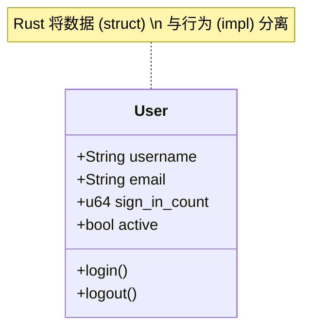
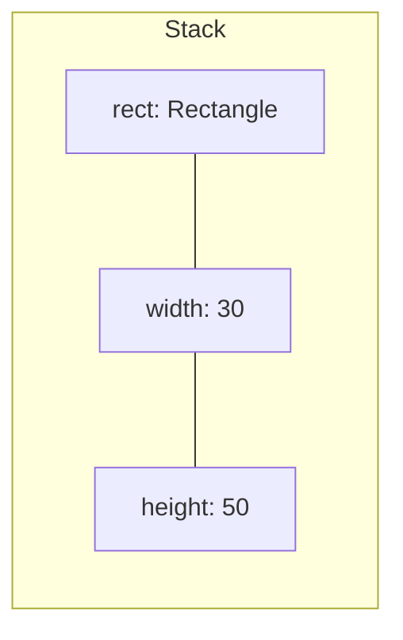

# Day 07: 结构体 (Structs)

## 📝 学习目标

- 掌握 Rust 中三种结构体形态
- 理解结构体与 "类 (Class)" 的异同
- 掌握 `impl` 块定义方法与关联函数
- 了解结构体在内存中的布局
- 学会处理结构体中的所有权问题

## 🎯 核心概念：数据的蓝图

结构体 (`Struct`) 是让开发者将相关联的多个值打包成一个有意义的整体。
如果你来自 Java 或 C++，你可以把结构体 + `impl` 块看作是 **更轻量的类 (Class)**。



---

## 🏗️ 结构体的三种形态

Rust 提供了三种结构体形式，适应不同场景：

| 形式 | 名称 | 例子 | 适用场景 |
| :--- | :--- | :--- | :--- |
| **经典结构体** | C-Style Struct | `struct User { name: String }` | 最常用，字段有明确含义 |
| **元组结构体** | Tuple Struct | `struct Color(i32, i32, i32);` | 字段含义显而易见，不想费劲起名 |
| **类单元结构体** | Unit-Like Struct | `struct AlwaysEqual;` | 不需要存数据，通常用于实现 Trait |

### 1. 经典结构体 (Named-Field Struct)

```rust
struct User {
    username: String,
    email: String,
    sign_in_count: u64,
    active: bool,
}

// 实例化
let user1 = User {
    email: String::from("someone@example.com"),
    username: String::from("someusername123"),
    active: true,
    sign_in_count: 1,
};
```

### 2. 元组结构体 (Tuple Struct)

```rust
struct Color(i32, i32, i32);
struct Point(i32, i32, i32);

let black = Color(0, 0, 0);
let origin = Point(0, 0, 0);

// 使用索引访问
println!("Black red value: {}", black.0);
```

### 3. 类单元结构体 (Unit-Like Struct)

```rust
struct AlwaysEqual;
let subject = AlwaysEqual; // 类似于 () 单元类型
```

---

## ⚙️ 方法与关联函数 (`impl`)

Rust 使用 `impl` (Implementation) 关键字来定义结构体的行为。

### 方法 (Methods)

第一个参数总是 `self` (或其变体)，代表调用该方法的实例。

```rust
#[derive(Debug)]
struct Rectangle {
    width: u32,
    height: u32,
}

impl Rectangle {
    // &self 是 self: &Self 的简写
    fn area(&self) -> u32 {
        self.width * self.height
    }
    
    // 方法可以调用其他方法
    fn can_hold(&self, other: &Rectangle) -> bool {
        self.width > other.width && self.height > other.height
    }
}
```

### 关联函数 (Associated Functions)

不以 `self` 作为参数。通常用作 **构造函数**。
> **约定**：Rust 没有 `new` 关键字，但通常习惯用名为 `new` 的关联函数来创建实例。

```rust
impl Rectangle {
    fn square(size: u32) -> Rectangle {
        Rectangle {
            width: size,
            height: size,
        }
    }
}

// 调用方式：使用 :: 语法
let sq = Rectangle::square(3);
```

---

## 💾 内存与所有权

### 内存布局

结构体的字段在内存中是紧凑排列的（编译器可能会重排字段顺序以优化内存对齐）。



### ⚠️ 重要：结构体字段的所有权

初学者常见的陷阱是试图在结构体中使用 `&str` (引用) 而不是 `String`。

```rust
struct User {
    username: &str, // ❌ 编译错误：缺少生命周期
    email: &str,
}
```

**为什么？**
如果结构体持有引用，那么这个结构体的存活时间不能超过它引用的数据的存活时间。这需要 **生命周期 (Lifetimes)** 的知识（Day 14 才会学）。

**最佳实践**：**在初学阶段，始终在结构体中使用 `String` 拥有完全的所有权。** 这样结构体可以"拥有"它的数据，只要结构体有效，数据就有效。

---

## 🛠️ 关于打印调试

直接使用 `println!("{}", rect)` 会报错，因为结构体默认没有实现 `Display` trait。

1. 添加 `#[derive(Debug)]` 属性。
2. 使用 `{:?}` (单行调试) 或 `{:#?}` (多行美化调试)。

```rust
#[derive(Debug)]
struct User { ... }

println!("{:?}", user); 
// User { username: "a", ... }

println!("{:#?}", user);
// User {
//    username: "a",
//    ...
// }
```

---

## 💻 代码实战

```rust
#[derive(Debug)]
struct Rectangle {
    width: u32,
    height: u32,
}

impl Rectangle {
    fn area(&self) -> u32 {
        self.width * self.height
    }
}

fn main() {
    let rect1 = Rectangle { width: 30, height: 50 };

    println!("rect1 is {:#?}", rect1);
    println!("The area of rect1 is {} square pixels.", rect1.area());
}
```

---

## 🏋️ 练习题

👉 **[点击这里查看练习题](./exercises/README.md)**

1. **定义 User 结构体**：包含基本的注册信息。
2. **实现方法**：添加一个修改 User 状态的方法 (`&mut self`)。
3. **构造函数**：实现 `User::new()`。

---

## ⏭️ 下一步

如果我们需要一种类型，它只能是几个固定的值之一（比如 IP 地址要么是 V4 要么是 V6），结构体就不太好用了。
这时候我们需要 **枚举 (Enums)**。

下一节: [Day 08: 枚举与模式匹配 (Enums)](../08.Enums/README.md)
