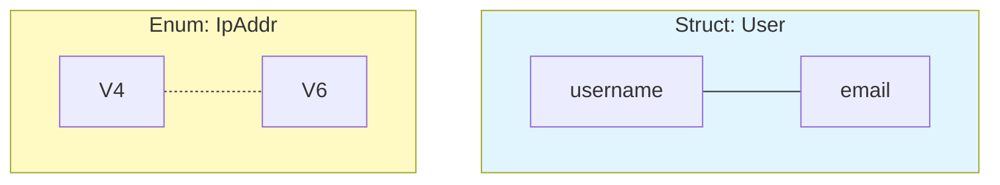
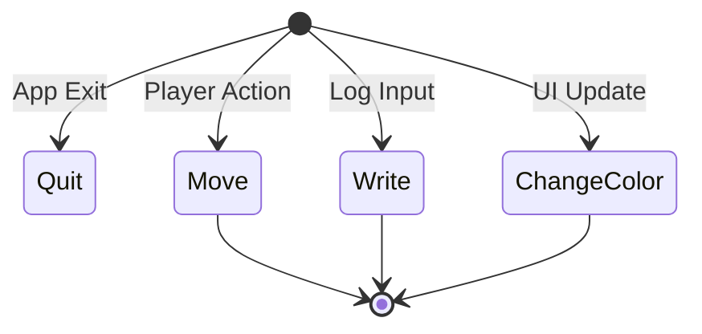
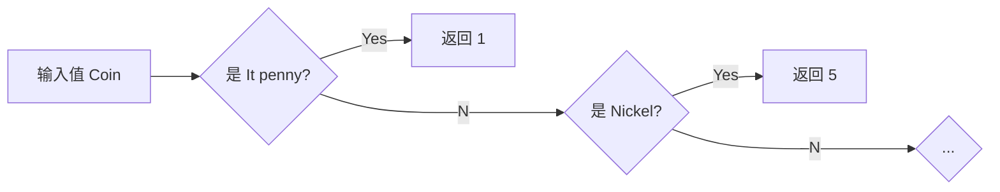

# Day 08: 枚举与模式匹配 (Enums & Pattern Matching)

## 📝 学习目标

- 理解 **枚举 (Enums)** 与 **结构体** 的本质区别
- 掌握 **`Option<T>`** 如何解决"空指针"问题
- 熟练使用 **`match`** 控制流进行模式匹配
- 理解穷尽性检查 (Exhaustiveness)
- 掌握 **`if let`** 语法糖

## 🎯 核心概念：数据的"或"关系

- **结构体 (Struct)** 定义的是 **AND** 关系：一个 User **既有** username **又有** email。
- **枚举 (Enum)** 定义的是 **OR** 关系：一个 IP 地址 **要么是** V4，**要么是** V6。



---

## 🏗️ 定义枚举

枚举不仅能列出变体，还能**携带数据**。这让它非常适合描述状态机。

```rust
enum Message {
    Quit,                       // 类单元变体
    Move { x: i32, y: i32 },    // 匿名结构体变体
    Write(String),              // 元组变体
    ChangeColor(i32, i32, i32), // 元组变体
}
```

### 状态机示意图



### 内存布局

枚举在内存中通常是 `Tag + Max(Data)`。

- **Tag**: 一个整数，用来标记当前是哪个变体。
- **Data**: 分配的空间等于最大变体所需的空间 (Union)。

---

## 🍬 Option<T>: 告别 Null Exception

Rust 没有 `null`。
在其他语言中，`null` 引发了无数的 `NullPointerException` (所谓的"十亿美元错误")。
Rust 使用 `Option<T>` 枚举来显式处理空值。

```rust
enum Option<T> {
    Some(T), // 有值
    None,    // 无值
}
```

**为什么这更安全？**

- 你不能把 `Option<i32>` 直接当 `i32` 算术运算。编译器会强制你先检查是不是 `None`。
- 这迫使你在写代码时就考虑到"如果为空怎么办"。

```rust
let some_number = Some(5);
let some_string = Some("a string");
let absent_number: Option<i32> = None;
```

---

## 🔀 match 控制流

`match` 是 Rust 中最强大的控制流运算符。它将一个值与一系列模式进行比较。



```rust
enum Coin {
    Penny,
    Nickel,
    Dime,
    Quarter,
}

fn value_in_cents(coin: Coin) -> u8 {
    match coin {
        Coin::Penny => 1,
        Coin::Nickel => 5,
        Coin::Dime => 10,
        Coin::Quarter => 25,
    }
}
```

### 1. 绑定值 (Binding)

匹配不仅能判断类型，还能把变体里的数据提取出来。

```rust
enum IpAddr {
    V4(String),
    V6(String),
}

let home = IpAddr::V4(String::from("127.0.0.1"));

match home {
    IpAddr::V4(s) => println!("IPv4: {}", s), // s 绑定了 "127.0.0.1"
    IpAddr::V6(s) => println!("IPv6: {}", s),
}
```

### 2. 穷尽性 (Exhaustiveness)

**Rust 编译器保证通过**：你必须处理所有可能的情况。

```rust
let x = Some(5);
match x {
    Some(i) => println!("{}", i),
    None => (), // 必须写，否则编译报错！
}
```

> 小技巧：使用 `_` 通配符来忽略其余所有情况。

---

### 3. if let 语法糖

当你只关心 **一种** 匹配而想忽略其他所有情况时，`match` 有点啰嗦。这时用 `if let`。

```rust
let config_max = Some(3u8);

// 啰嗦的 match
match config_max {
    Some(max) => println!("Max is {}", max),
    _ => (),
}

// 简洁的 if let
if let Some(max) = config_max {
    println!("Max is {}", max);
}
```

**代价**：失去了穷尽性检查。

---

## 💻 代码实战：Option 运算

我们要写一个函数：如果是 `Some(i)` 就加 1，如果是 `None` 就不变。

```rust
fn plus_one(x: Option<i32>) -> Option<i32> {
    match x {
        None => None,          // 如果没值，返回没值
        Some(i) => Some(i + 1), // 如果有值，拿出来加1再包回去
    }
}

fn main() {
    let five = Some(5);
    let six = plus_one(five); // Some(6)
    let none = plus_one(None); // None
    
    println!("{:?}", six);
}
```

---

## 🏋️ 练习题

👉 **[点击这里查看练习题](./exercises/README.md)**

1. **定义枚举**: 创建一个表示各种货币的枚举。
2. **模式匹配**: 编写一个将货币转换为美分的函数。
3. **Option 处理**: 修复一些未处理 `None` 的代码。

---

## 💡 最佳实践

1. **优先使用标准库枚举**: `Option<T>` 和 `Result<T, E>` (下一章会讲) 是 Rust 的基石，到处都在用。
2. **慎用 `unwrap()`**: 虽然 `some_value.unwrap()` 很方便（直接拿值，如果是 None 就崩溃），但在正式代码中，请尽量用 `match` 或 `unwrap_or` 等安全方法方法。
3. **状态机建模**: 如果一个对象有明确的几个阶段（如 `Init`, `Running`, `Finished`），用枚举建模是最好的选择。

---

## ⏭️ 下一步

代码越来越多，全堆在一个文件里可不行。是时候像整理房间一样整理代码了。
我们需要 **模块系统 (Modules)**。

下一节: [Day 09: 模块系统](../09.Modules/README.md)
