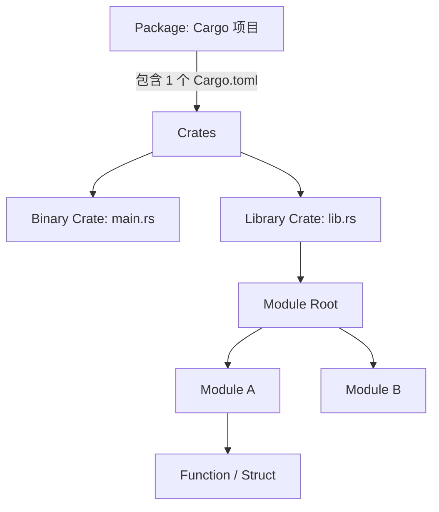
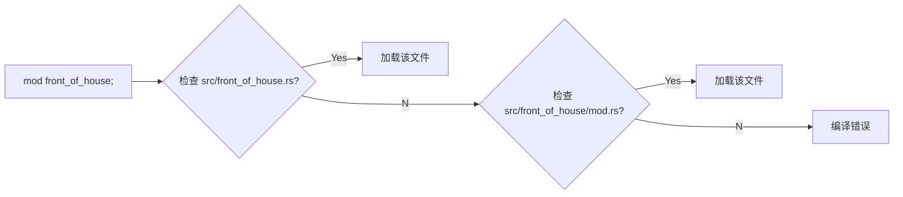

# Day 09: 模块系统 (Modules)

## 📝 学习目标

- 理解 Rust 代码组织的三层结构：Package -> Crate -> Module
- 掌握 **模块树 (Module Tree)** 的构建与导航
- 彻底理解 **可见性 (`pub`)** 规则
- 熟练运用 **`use`** 和 **`pub use`**
- 掌握将模块拆分为单文件或多文件的最佳实践

## 🎯 核心概念：代码的文件系统

随着项目变大，把所有代码写在一个文件里是不可行的。Rust 的模块系统就像电脑的文件系统：

- **Crate** 就像一个磁盘分区（C盘/D盘）。
- **Module** 就像文件夹，可以嵌套。
- **Item** (函数/结构体) 就像文件。

我们通过 **路径 (Paths)** 来找到它们。

---

## 🏗️ 代码组织层次



1. **Package (包)**: Cargo 的功能单元，包含 `Cargo.toml`。
2. **Crate (箱)**: 编译单元。
    - **Binary Crate**: 可执行文件 (`src/main.rs`)。
    - **Library Crate**: 库文件 (`src/lib.rs`)。
3. **Module (模块)**: 组织代码的逻辑单元。

---

## 🌳 模块树与路径

假设我们构建一个餐厅库 `restaurant`。即使所有代码都在 `lib.rs` 里，它们也形成了树状结构。

```rust
// lib.rs (Crate Root)
mod front_of_house {
    pub mod hosting {
        pub fn add_to_waitlist() {}
    }
}

pub fn eat_at_restaurant() {
    // 绝对路径
    crate::front_of_house::hosting::add_to_waitlist();

    // 相对路径
    front_of_house::hosting::add_to_waitlist();
}
```

### 路径解析表

| 路径类型 | 关键字 | 说明 | 例子 |
| :--- | :--- | :--- | :--- |
| **绝对路径** | `crate` | 从根模块 (Root) 开始 | `crate::front_of_house::xx` |
| **相对路径** | `self` | 从当前模块开始 | `self::xx` (通常省略) |
| **父级路径** | `super` | 从父模块开始 (类似 `../`) | `super::xx` |

---

## 👁️ 可见性 (Visibility)

Rust 的默认行为是 **私有 (Private)**。这与其他语言不同。

- **红灯 (Private)**: 默认情况。父模块无法访问子模块的私有项。同级模块可以互访。
- **绿灯 (Public)**: 使用 `pub` 关键字。对任何人开放。

```mermaid
graph TD
    subgraph CrateRoot [Crate Root]
        eat[fn eat_at_restaurant]
        
        subgraph ModFront [mod front_of_house]
            subgraph ModHosting [pub mod hosting]
                add[pub fn add_to_waitlist]
                seat[fn seat_at_table (Private)]
            end
            
            subgraph ModServing [mod serving]
                take[fn take_order]
            end
        end
    end
    
    eat -->|✅ Pub| ModFront
    eat -->|✅ Pub| ModHosting
    eat -->|✅ Pub| add
    eat -.->|❌ Private| seat
    eat -.->|❌ Private| ModServing
    
    style seat fill:#ffcccc,stroke:#ff0000
    style ModServing fill:#ffcccc,stroke:#ff0000
    style add fill:#ccffcc,stroke:#00ff00
```

> **规则**：要想访问深层模块的函数，路径上的**每一个**模块都必须是 `pub` 的。

---

## 📍 use 关键字

`use` 就像创建快捷方式（软链接）。

```rust
mod front_of_house {
    pub mod hosting {
        pub fn add_to_waitlist() {}
    }
}

// 引入路径到作用域
use crate::front_of_house::hosting;

pub fn eat_at_restaurant() {
    hosting::add_to_waitlist(); // 简短多了！
}
```

### 处理命名冲突：`as`

```rust
use std::fmt::Result;
use std::io::Result as IoResult; // 重命名

fn function1() -> Result { ... }
fn function2() -> IoResult<()> { ... }
```

### 重导出 (`pub use`)

当你希望将内部结构隐藏，对外暴露统一的 API 时使用。

```rust
mod front_of_house {
    pub mod hosting { ... }
}

// 外部用户可以直接通过 restaurant::hosting 访问，而不需要知道 front_of_house 的存在
pub use crate::front_of_house::hosting;
```

---

## 📂 文件与模块拆分

当 `lib.rs` 变得太长时，我们应该拆分文件。Rust 会根据模块名自动查找文件。

**假设 `lib.rs` 内容：**

```rust
mod front_of_house; // 声明模块，内容去文件里找
```

**Rust 查找顺序图：**



### 推荐目录结构

```text
src/
├── lib.rs              (包含 mod front_of_house;)
└── front_of_house.rs   (包含 mod hosting;)
    └── hosting.rs      (包含 fn add_to_waitlist)
```

注意：如果 `front_of_house` 有子模块，需要创建一个同名文件夹。

---

## 🏋️ 练习题

👉 **[点击这里查看练习题](./exercises/README.md)**

1. **修复可见性**: 修改代码使父模块能访问子模块函数。
2. **使用 use**: 简化冗长的函数调用路径。
3. **文件拆分**: 将一个巨型 `lib.rs` 拆分成多个文件。

---

## 💡 最佳实践

1. **lib.rs vs main.rs**: 尽量把逻辑放入 `lib.rs`，`main.rs` 只负责启动。这样代码更容易测试和复用。
2. **避免 `use *`**: 通配符导入会污染作用域，让你不知道名字是哪来的。只在测试模块 (`tests`) 中使用。
3. **绝对路径优先**: 在定义 `use` 时，尽量使用 `crate::` 开头的绝对路径，这样代码移动时如果不跨 crate 会更稳定（或者出错更明显）。

---

## ⏭️ 下一步

代码组织好了，接下来我们需要了解 Rust 标准库中最常用的工具——集合。

下一节: [Day 10: 常用集合 (Common Collections)](../10.CommonCollections/README.md)
