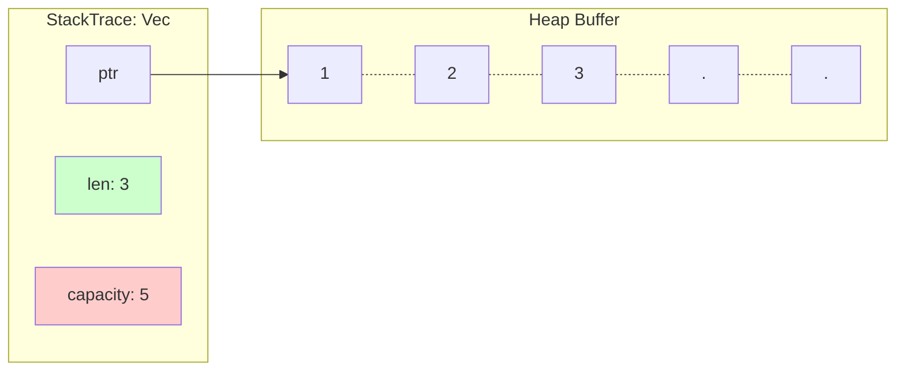
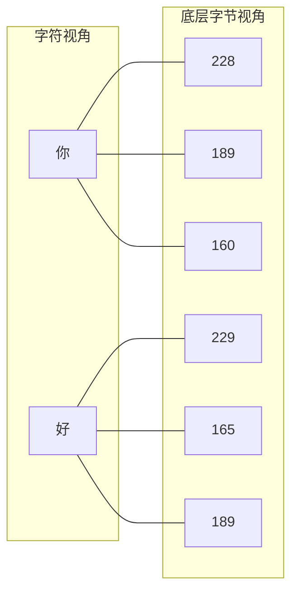

# Day 10: 常用集合 (Common Collections)

## 📝 学习目标

- 掌握 **Vector (`Vec<T>`)** 的内存布局与动态增长机制
- 深入理解 **String** (UTF-8) 为什么不支持索引
- 熟练使用 **HashMap (`HashMap<K, V>`)**
- 理解集合与 **所有权 (Ownership)** 的交互
- 学会使用 `with_capacity` 优化性能

## 🎯 核心概念：堆上的动态数据

Rust 标准库提供了一系列强大的数据结构，称为 **集合 (Collections)**。
与数组 (`[T; N]`) 和元组不同，集合的数据存储在 **堆 (Heap)** 上，这意味着：

1. **动态大小**：不需要在编译时知道大小，可以随时通过 API 增长或缩小。
2. **所有权管理**：集合拥有其存储的数据，集合被 Drop 时，数据也会被 Drop。

---

## 1. Vector (向量)

`Vec<T>` 是一个可增长的数组。它是 Rust 中最常用的集合。

### 内存布局

`Vec<T>` 在栈上由三个字段组成，指向堆上的数据缓冲区。



* **len (长度)**: 当前存了多少个元素。
- **capacity (容量)**: 堆上预分配了多少空间。当 `push` 超过容量时，Vec 会自动重新分配更大的内存（通常翻倍）并搬运数据。

### 常用操作

```rust
// 创建：使用 vec! 宏
let mut v = vec![1, 2, 3];

// 添加
v.push(4); 

// 读取：推荐使用 get，处理越界安全
match v.get(100) {
    Some(value) => println!("Value is {}", value),
    None => println!("Index out of bounds!"),
}
// v[100] // ❌ 这会导致 panic

// 遍历
for i in &v {
    println!("{}", i);
}
```

---

## 2. String (字符串)

**Rust 的 `String` 是 UTF-8 编码的字节序列。** 这与 C++ 或 Java 的字符串有本质区别。

### 为什么不支持索引 `s[0]`？

假设有一个字符串 `s = "你好"`。
在 UTF-8 编码中，汉字通常占 3 个字节。



- 长度 `s.len()` 是 **6** (字节数)。
- 如果你试图访问 `s[0]`，你只能拿到 `228` 这个字节，它没有任何意义，也不是"你"的一半。
- 为了避免歧义和 O(N) 的索引性能陷阱，Rust **禁止** 使用 `[]` 索引字符串。

### 正确的遍历方式

- **遍历字符**: 使用 `.chars()`
- **遍历字节**: 使用 `.bytes()`

```rust
for c in "你好".chars() {
    println!("{}", c); // 打印 "你", "好"
}
```

---

## 3. HashMap (哈希表)

`HashMap<K, V>` 使用哈希函数将键映射到值。

```mermaid
graph LR
    Key[Key: "Blue"] --> HashFunc[Hash Function]
    HashFunc --> Index[Index: 2]
    Index --> Bucket[Value: 10]
```

### 所有权规则

- 对于实现了 `Copy` 的类型 (`i32`, `bool`)，数据会被复制进 HashMap。
- 对于拥有所有权的类型 (`String`)，所有权会被 **移动 (Move)** 进 HashMap。

```rust
use std::collections::HashMap;

let field_name = String::from("Favorite color");
let field_value = String::from("Blue");

let mut map = HashMap::new();
map.insert(field_name, field_value);
// ⚠️ field_name 和 field_value 在这里失效了！被移到了 map 中。
```

### 给力的 Entry API

不仅可以插入数据，还可以根据键是否存在来执行逻辑，代码非常优雅。

```rust
let mut scores = HashMap::new();
scores.insert(String::from("Blue"), 10);

// "Yellow" 不存在，插入 50
scores.entry(String::from("Yellow")).or_insert(50);
// "Blue" 存在，不修改，返回 10
scores.entry(String::from("Blue")).or_insert(50);
```

---

## 💡 性能优化：`with_capacity`

由于 Vec 和 HashMap 在增长时需要重新分配内存和拷贝数据（开销昂贵），如果你预先知道大概有多少数据，**请务必使用 `with_capacity`**。

```rust
// 😡 可能会重新分配多次（1->2->4->8...）
let mut v = Vec::new();
for i in 0..1024 { v.push(i); }

// 😍 只分配一次内存
let mut v = Vec::with_capacity(1024);
for i in 0..1024 { v.push(i); }
```

---

## 🏋️ 练习题

👉 **[点击这里查看练习题](./exercises/README.md)**

1. **统计工具**: 给定一组整数，计算平均数、中位数和众数。
2. **Pig Latin**: 实现一个简单的单词转换逻辑，练习字符串处理。
3. **部门管理**: 使用 HashMap 管理"部门->员工列表"的关系。

---

## ⏭️ 下一步

到目前为止，我们写的代码如果出错（比如 Vector 越界）就会 Panic 崩溃。实际上 Rust 有一套非常完善的 **错误处理** 机制，可以让我们稳健地处理异常。

下一节: [Day 11: 错误处理 (Error Handling)](../11.ErrorHandling/README.md)
