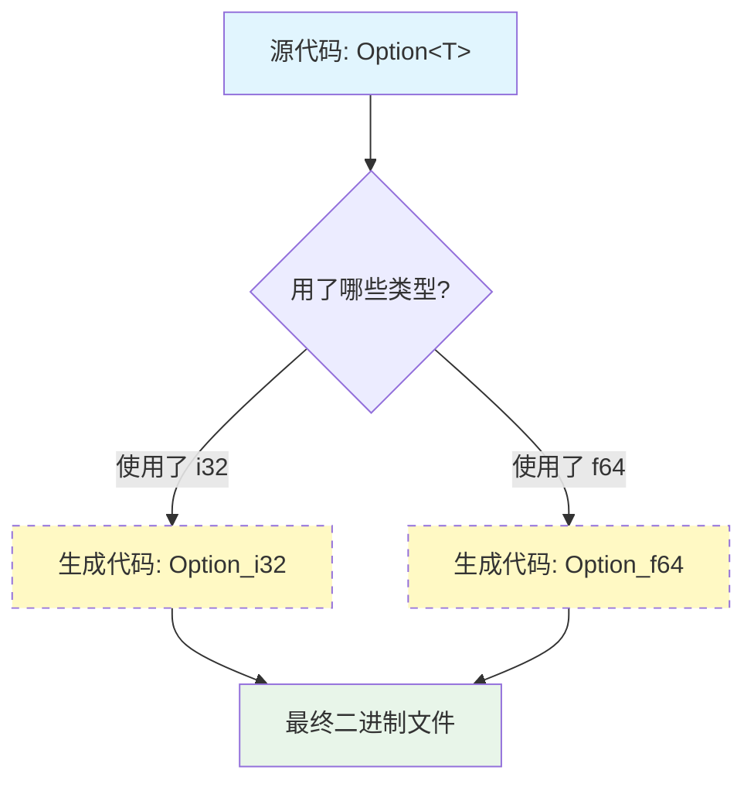

# Day 12: 泛型 (Generics)

## 📝 学习目标

- 理解 **泛型 (Generics)** 的概念与作用
- 掌握在 **函数、结构体、枚举、方法** 中使用泛型
- 深入理解 **单态化 (Monomorphization)** 与 **零成本抽象**
- 读懂 `impl<T> Point<T>` 这种复杂的语法

## 🎯 核心概念：类型的占位符

泛型通过使用 **占位符** 替换具体类型，来减少代码重复。
> **比喻**：函数参数 `fn foo(value: i32)` 里的 `value` 是 **值** 的占位符。泛型 `fn foo<T>(arg: T)` 里的 `T` 是 **类型** 的占位符。

---

## 🏗️ 泛型的应用场景

### 1. 泛型函数

使用 `<T>` 声明泛型参数。

```rust
// 读取：函数 largest 对于任意类型 T，接收 T 的切片，返回 T
fn largest<T>(list: &[T]) -> T { ... }
```

### 2. 泛型结构体

```rust
struct Point<T> {
    x: T,
    y: T,
}

let integer = Point { x: 5, y: 10 };
let float = Point { x: 1.0, y: 4.0 };
```

### 3. 泛型枚举

最经典的两个例子：

```rust
enum Option<T> {
    Some(T),
    None,
}

enum Result<T, E> {
    Ok(T),
    Err(E),
}
```

---

## ⚙️ 泛型方法与语法解析

这部分语法初学者容易晕：

```rust
struct Point<T> {
    x: T,
    y: T,
}

// 语法解析：
// impl<T>  : 告诉编译器 "Hey，后面的 T 是泛型，不是具体的 struct 名字"
// Point<T> : 我们正在为泛型结构体 Point<T> 实现方法
impl<T> Point<T> {
    fn x(&self) -> &T {
        &self.x
    }
}
```

**可以为特定类型实现特有方法：**

```rust
// 这里的 impl 后面没有 <f32>，因为 f32 是具体类型
impl Point<f32> {
    fn distance_from_origin(&self) -> f32 {
        (self.x.powi(2) + self.y.powi(2)).sqrt()
    }
}
```

---

## 🚀 性能秘密：单态化 (Monomorphization)

很多语言（如 Java）的泛型在运行时会有性能损耗（Type Erasure / Boxing）。
**Rust 的泛型是零成本抽象 (Zero Cost Abstraction)。**

**原理**：在编译期间，Rust 编译器会进行 **单态化** — 为每一个用到的具体类型生成一份专门的代码副本。



这意味着：

1. **编译变慢**：编译器要做更多工作。
2. **文件变大**：生成了多份代码。
3. **运行极快**：运行时就像手写了 `IntOption`, `FloatOption` 一样，没有虚函数调用开销，是 **静态分发 (Static Dispatch)**。

---

## ⚖️ 多种泛型参数

你可以使用多个泛型参数，用逗号分隔。

```rust
struct Point<T, U> {
    x: T, // x 是类型 T
    y: U, // y 是类型 U
}

let p = Point { x: 5, y: 4.0 }; // T=i32, U=f64
```

> **最佳实践**：泛型参数过多会导致代码难以阅读。如果超过 3 个，通常意味着你的代码需要重构了。

---

## 🏋️ 练习题

👉 **[点击这里查看练习题](./exercises/README.md)**

1. **实现泛型结构体**: 创建一个坐标点结构体，支持不同数值类型。
2. **交换函数**: 编写一个泛型函数 `swap`，交换两个值的位置。
3. **方法实现**: 为你的泛型结构体实现 getter 方法。

---

## 💡 最佳实践

1. **命名规范**:
    - 第一个泛型参数通常叫 `T` (Type)。
    - 或者是 `E` (Error), `K` (Key), `V` (Value)。
    - 如果含义复杂，可以用全名，如 `R: Reader`。
2. **Trait Bounds (预告)**: 单写 `<T>` 意味着 T 可以是任何类型。但如果你想在函数里比较大小 (`a > b`)，必须限制 `T` 实现了比较功能。这将在下一节 Trait 中详细讲解。

---

## ⏭️ 下一步

现在我们的函数可以接收任意类型 `T` 了。但是，如果我们想规定 `T` 必须有 "打印功能" 或者 "比较功能" 怎么办？
我们需要一种机制来描述类型**能做什么**。

下一节: [Day 13: Trait (特性)](../13.Traits/README.md)
