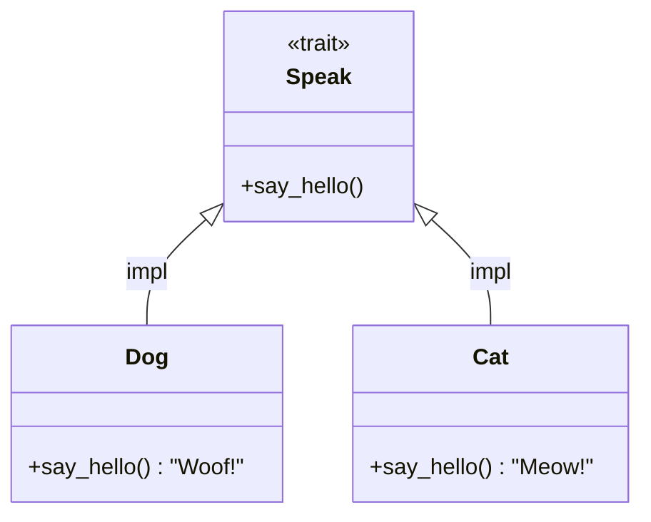

# Day 13: Trait (特征)

## 📝 学习目标

- 理解 **Trait** 的核心概念（类似接口）
- 掌握如何 **定义 Trait** 和 **实现 Trait**
- 熟练使用 **Trait Bounds** (约束) 写泛型代码
- 彻底理解 **孤儿规则 (Orphan Rule)**
- 了解 **派生宏** (`#[derive]`) 的魔力

## 🎯 核心概念：定义共享行为

**Trait (特征)** 告诉 Rust 编译器：某种类型具有哪些功能，可以与其他类型共享这些行为。
> **比喻**：不管你是猫(`Cat`)还是狗(`Dog`)，只要你会叫(`Speak`)，我就能把你当宠物对待。



---

## 🏗️ 定义与实现

### 1. 定义 Trait

Trait 定义了一组方法签名。

```rust
pub trait Summary {
    fn summarize(&self) -> String; // 没有大括号，只有分号

    // 默认实现 (Default Implementation)
    fn summarize_author(&self) -> String {
        String::from("(Read more...)")
    }
}
```

### 2. 为类型实现 Trait (`impl for`)

```rust
pub struct Tweet {
    pub username: String,
    pub content: String,
}

impl Summary for Tweet {
    fn summarize(&self) -> String {
        format!("{}: {}", self.username, self.content)
    }
}
```

---

## 🔗 Trait 作为参数 (Trait Bounds)

我们可以编写函数，接受任何实现了 `Summary` 的类型。有三种写法：

| 写法 | 语法 | 适用场景 |
| :--- | :--- | :--- |
| **语法糖** | `fn notify(item: &impl Summary)` | 简单直观，参数少时推荐 |
| **标准写法** | `fn notify<T: Summary>(item: &T)` | 当有多个参数需同一类型时 (`T` vs `impl`) |
| **Where 子句** | `fn notify<T>(...) where T: Summary` | 约束太长，为了可读性 |

### 示例：多重约束

如果我要求参数既能 `Summary` 又能 `Display`：

```rust
// 语法糖
fn notify(item: &(impl Summary + Display)) { ... }

// Where 子句 (清晰)
fn some_function<T, U>(t: &T, u: &U) -> i32
where
    T: Display + Clone,
    U: Clone + Debug,
{ ... }
```

---

## 🚫 孤儿规则 (Orphan Rule)

为了保证代码的一致性和避免冲突，Rust 规定：
**你只能为类型实现 Trait，如果：Trait 是本地定义的，或者 类型是本地定义的。**
(简言之：**要么 Trait 是你的，要么 Type 是你的**)

| 类型 (Type) | 特征 (Trait) | 允许实现? | 例子 |
| :--- | :--- | :--- | :--- |
| **本地** (`Tweet`) | **本地** (`Summary`) | ✅ Yes | 正常实现 |
| **本地** (`Tweet`) | **外部** (`Display`) | ✅ Yes | 给自己的类型加打印功能 |
| **外部** (`Vec`) | **本地** (`Summary`) | ✅ Yes | 给标准库类型加自己的功能 |
| **外部** (`Vec`) | **外部** (`Display`) | ❌ NO | **禁止！** 防止破坏标准库行为 |

> **解决方法**：如果你非要给 `Vec` 实现 `Display`，可以创建一个 **Newtype** (元组结构体包装器) `struct MyVec(Vec<T>)`，然后给 `MyVec` 实现。

---

## 🏭 返回 impl Trait

函数可以返回实现了某个 Trait 的类型，而不需要在签名中写出具体类型。这在闭包和迭代器中非常常用。

```rust
fn returns_summarizable() -> impl Summary {
    Tweet {
        username: String::from("horse_ebooks"),
        content: String::from("of course, as you probably already know, people"),
    }
}
```

**限制**：函数体内返回的所有可能的代码分支，必须返回 **同一种** 类型。不能 `if` 返回 `Dog`，`else` 返回 `Cat`。

---

## ⚡ 派生宏 (Derive)

对于一些通用的标准库 Trait，Rust 编译器可以帮我们自动生成实现代码。

```rust
#[derive(Debug, Clone, Copy, PartialEq)]
struct Point {
    x: i32,
    y: i32,
}
```

加上这行注解后，`Point` 就自动拥有了打印调试 (`Debug`)、克隆 (`Clone`)、值拷贝 (`Copy`) 和 比较相等 (`PartialEq`) 的能力。

---

## 🏋️ 练习题

👉 **[点击这里查看练习题](./exercises/README.md)**

1. **定义 Trait**: 创建一个 `Shape` trait，包含 `area()` 方法。
2. **实现 Trait**: 为 `Rectangle` 和 `Circle` 实现 `Shape`。
3. **泛型函数**: 编写一个函数，接受任何 `Shape` 并打印面积。

---

## 💡 最佳实践

1. **Orphan Rule**: 牢记孤儿规则，不要试图给 `String` 实现 `Display`。
2. **Trait Bounds**: 尽量使用 `where` 子句来保持函数签名整洁。
3. **Blanket Implementation**: 可以为所有实现了 `Trait A` 的类型自动实现 `Trait B`。例如标准库：`impl<T: Display> ToString for T { ... }` (所以任何实现了 Display 的都有 to_string 方法)。

---

## ⏭️ 下一步

现在我们有了代码复用 (Generic) 和行为抽象 (Trait)。
但是，如果我们的结构体里存了一个引用，Rust 怎么知道这个引用什么时候是有效的？如果原来的数据死了，引用还在怎么办？
这就是 Rust 最独特、最让新手头秃的概念 —— **生命周期**。

下一节: [Day 14: 生命周期 (Lifetimes)](../14.Lifetimes/README.md)
