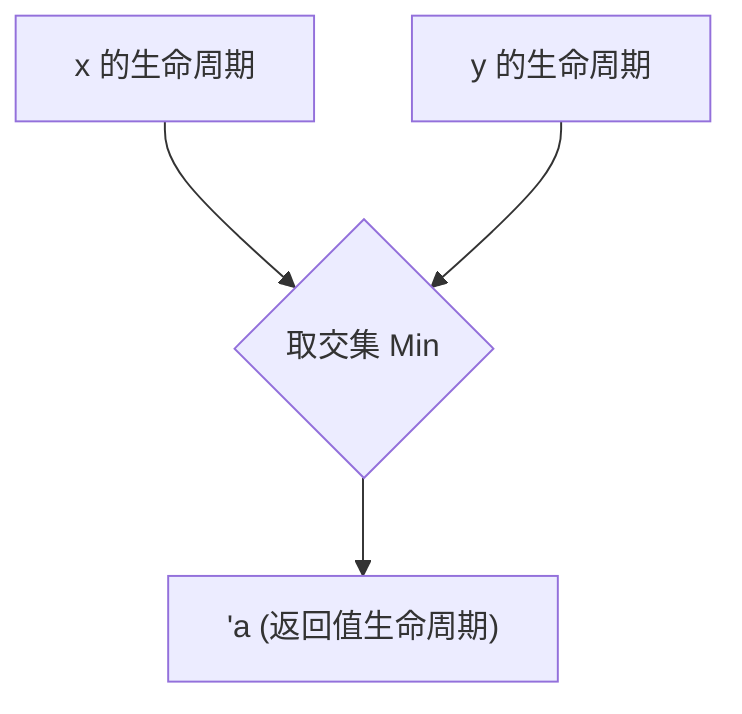

# Day 14: 生命周期 (Lifetimes)

## 📝 学习目标

- 理解生命周期的本质：**有效作用域 (Valid Scope)**
- 掌握生命周期注解语法 (`'a`) 及其含义
- 理解 **生命周期省略规则 (Elision Rules)**
- 能够处理函数和结构体中的生命周期
- 理解 `'static` 生命周期

## 🎯 核心概念：避免悬垂引用

Rust 的生命周期不仅仅是为了让编译器开心，它的根本目的是为了 **内存安全**，特别是避免 **悬垂引用 (Dangling References)**。
悬垂引用是指：引用指向的数据已经被释放了，但引用还在。

### 错误的生命周期示例

```rust
{
    let r;
    {
        let x = 5;
        r = &x; // ❌ 错误：`x` 在这里即将死亡，但 `r` 还要活到外面
    } // `x` 被 drop，内存释放
    println!("r: {}", r); // `r` 指向了无效内存！
}
```

### 作用域可视化 (Gantt Chart)

```mermaid
gantt
    title 生命周期对比
    dateFormat X
    axisFormat %s
    
    section 变量存活时间
    x (内部变量)   : 2, 4
    r (外部引用)   : 1, 6
```



**解释**：`r` 的生命周期覆盖了 `1-6`，但 `x` 只活在 `2-4`。`r` 试图在时间点 `5` 访问 `x`，这是非法的。

---

## 🏷️ 生命周期注解 (Annotations)

当引用的生命周期关系不明确时（例如函数返回两个引用参数中的一个），Rust 需要必须要你显式标注。

> **重要**：生命周期注解 **不会改变** 任何引用的实际存活时间。它只是告诉编译器这些引用之间的 **约束关系**。

### 语法解析

- `&i32`        // 引用
- `&'a i32`     // 带有显式生命周期 'a 的引用
- `&'a mut i32` // 带有显式生命周期 'a 的可变引用

### 函数中的生命周期

```rust
// 读作：`longest` 函数有两个参数 `x` 和 `y`。
// 它们和返回值至少都要活得和 `'a` 一样长。
fn longest<'a>(x: &'a str, y: &'a str) -> &'a str {
    if x.len() > y.len() { x } else { y }
}
```

**`'a` 到底是什么？**
实际上，`'a` 等于 `x` 和 `y` 实际生命周期的 **交集 (Intersection)**，也就是 **较短的那个**。



---

## 🏗️ 结构体中的生命周期

如果结构体持有 **引用**，它必须标注生命周期。这保证了结构体实例（持有者）不能活得比它引用的数据（借用物）更久。

```rust
// 这个结构体不能活得比 `part` 引用的字符串更久
struct ImportantExcerpt<'a> {
    part: &'a str,
}

fn main() {
    let novel = String::from("Call me Ishmael. Some years ago...");
    let first_sentence = novel.split('.').next().expect("Could not find a '.'");
    
    // i 持有 novel 的引用
    let i = ImportantExcerpt {
        part: first_sentence,
    };
}
```

---

## 🙈 生命周期省略规则 (Elision Rules)

你可能发现，类似于 `fn first_word(s: &str) -> &str` 这样的函数没加 `'a` 也能编译。这是因为 Rust 编译器内置了三条规则来自动推断：

1. **输入规则**: 每个引用参数都有自己独立的生命周期。(`fn foo<'a, 'b>(x: &'a i32, y: &'b i32)`)
2. **输出规则 1**: 如果只有一个输入生命周期，那么它被赋予所有输出引用。(`fn foo<'a>(x: &'a i32) -> &'a i32`)
3. **输出规则 2**: 如果方法有 `&self` 或 `&mut self`，那么 `self` 的生命周期被赋予所有输出引用。

只有当这三条规则都不适用时，编译器才会报错，要求你手动标注。

---

## ♾️ 'static 生命周期

`'static` 是一个特殊的生命周期，表示引用可以在 **整个程序运行期间** 存活。

1. **字符串字面值**: 所有的 `&str` 字面值默认都是 `'static` 的（存储在二进制的数据段中）。

    ```rust
    let s: &'static str = "I have a static lifetime.";
    ```

2. **Trait Bound**: `T: 'static` 表示 T 必须不包含任何非静态的引用（即 T 拥有所有权，或是 `'static` 的引用）。

---

## 🏋️ 练习题

👉 **[点击这里查看练习题](./exercises/README.md)**

1. **修复生命周期**: 给结构体和函数添加必要的 `'a`。
2. **双重引用**: 处理两个不同生命周期的参数。
3. **结构体工厂**: 编写一个返回带有生命周期的结构体的函数。

---

## 💡 最佳实践

1. **描述而非指令**: 记住注解是描述性的。如果你标注了 `'a` 但代码逻辑实际上做不到（比如试图返回局部变量的引用），编译器依然会报错。注解不能延长变量寿命。
2. **结构体持有引用**: 尽量让结构体拥有数据 (`String`) 而不是引用 (`&str`)。只有当你非常确定需要共享数据且不需要所有权时（如解析器的一个 View），才在结构体中使用引用。这能避免很多生命周期地狱。
3. **利用省略**: 先不写生命周期，等编译器报错了再思考怎么加。

---

## ⏭️ 下一步

恭喜你！你已经通过了 Rust 学习曲线上最陡峭的部分（所有权、借用、生命周期）。
接下来的内容会轻松很多。我们将学习如何为代码编写自动化测试，保证系统的稳定性。

下一节: [Day 15: 自动化测试 (Automated Tests)](../15.Testing/README.md)
