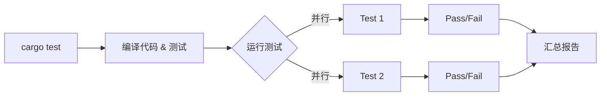

# Day 15: 自动化测试 (Automated Testing)

## 📝 学习目标

- 掌握 Rust **测试金字塔**：单元测试 vs 集成测试
- 熟练编写 **`#[test]`** 函数
- 掌握 **断言宏** (`assert!`, `assert_eq!`)
- 学会测试 **Panic** 和返回 **Result**
- 掌握 **Cargo Test** 常用命令与并行控制

## 🎯 核心概念：信心的来源

代码写完了，怎么保证它是对的？靠“肉眼观察”是不够的。
Rust 提供了 **第一类 (First-class)** 的测试支持，不需要安装任何第三方框架。

### 测试金字塔

```mermaid
graph TD
    UI[UI / E2E 测试 (慢, 覆盖面广)]
    Integration[集成测试 tests/ (中等, 测API交互)]
    Unit[单元测试 #[test] (快, 测具体逻辑)]
    
    UI --> Integration
    Integration --> Unit
    
    style Unit fill:#ccffcc
    style Integration fill:#ffffcc
    style UI fill:#ffcccc
```

1. **单元测试 (Unit Tests)**: 位于源码文件中，测试私有函数，关注微小逻辑。
2. **集成测试 (Integration Tests)**: 位于 `tests/` 目录，只能访问公有 API，关注组件协作。
3. **文档测试 (Doc Tests)**: 写在注释里，兼具文档和测试功能。

---

## 🛠️ 单元测试 (Unit Tests)

单元测试通常和代码在一起，放在一个叫 `tests` 的子模块中。

```rust
// 业务逻辑
fn internal_add(a: i32, b: i32) -> i32 { a + b }

// 测试模块
#[cfg(test)] // 只有运行 cargo test 时才编译这部分代码
mod tests {
    use super::*; // 引入外部模块的所有内容

    #[test] // 标记这是一个测试函数
    fn test_internal_add() {
        assert_eq!(internal_add(2, 2), 4);
    }
}
```

### 常用断言宏

| 宏 | 说明 | 示例 |
| :--- | :--- | :--- |
| `assert!(expr)` | 验证表达式为 `true` | `assert!(x > 5)` |
| `assert_eq!(a, b)` | 验证 `a == b` | `assert_eq!(2+2, 4)` |
| `assert_ne!(a, b)` | 验证 `a != b` | `assert_ne!(2+2, 5)` |
| `debug_assert!(...)` | 仅在 Debug 模式下运行 | (用于性能敏感处) |

---

## 🏗️ 进阶用法

### 1. 测试 Panic (`should_panic`)

有时我们需要确保代码 **正确地报错**（比如参数校验）。

```rust
#[test]
#[should_panic(expected = "必须大于 0")] // 检查 panic 信息
fn test_validation() {
    let g = Guess::new(-1); // 应该 panic
}
```

### 2. 使用 Result

测试函数也可以返回 `Result`，这样就可以在测试里使用 `?` 了。这在测试需要 setup 可能会失败的场景时非常有用。

```rust
#[test]
fn it_works() -> Result<(), String> {
    if 2 + 2 == 4 {
        Ok(())
    } else {
        Err(String::from("math broke"))
    }
}
```

---

## 🔗 集成测试 (Integration Tests)

在项目根目录下创建 `tests` 目录。这里的每个文件都会被编译成一个独立的 Crate。

```text
my_project/
├── src/
│   └── lib.rs
└── tests/
    └── integration_test.rs
```

```rust
// tests/integration_test.rs
use my_project; // 必须像外部用户一样导入

#[test]
fn it_adds_two() {
    assert_eq!(my_project::add_two(2), 4);
}
```

---

## ⚙️ 运行测试 (Cargo Test)

Rust 的测试运行器默认是 **并行** 的，且会 **捕获 (吞掉) 输出**。

| 命令 | 作用 |
| :--- | :--- |
| `cargo test` | 运行所有测试 |
| `cargo test -- --test-threads=1` | **串行运行** (避免数据库/文件冲突) |
| `cargo test -- --show-output` | 显示 `println!` 的输出 |
| `cargo test name` | 只运行名字包含 "name" 的测试 |



---

## 🏋️ 练习题

👉 **[点击这里查看练习题](./exercises/README.md)**

1. **编写单元测试**: 为简单的数学函数编写测试。
2. **覆盖边界情况**: 测试 0、负数、溢出等情况。
3. **集成测试**: 创建 `tests/` 目录并测试公有 API。

---

## 💡 最佳实践

1. **私有函数也能测**: Rust 允许单元测试直接调用私有函数，这是确保核心算法正确的好方法。
2. **TDD (测试驱动开发)**: 红(写失败测试) -> 绿(写代码通过) -> 重构。
3. **文档即测试**: 在 `lib.rs` 的文档注释中写 Example 代码，Rust 会自动运行它们。一举两得。

---

## ⏭️ 下一步

恭喜你完成了第一阶段（基础知识）的所有内容！
你已经掌握了 Rust 的核心语法、内存安全模型 (所有权/生命周期) 和工程化工具 (测试/模块)。

接下来，我们将进入 **Day 16: 闭包与迭代器**，开启函数式编程的大门。

下一节: [Day 16: 闭包 (Closures)](../Day16-30/16.Closures/README.md)
