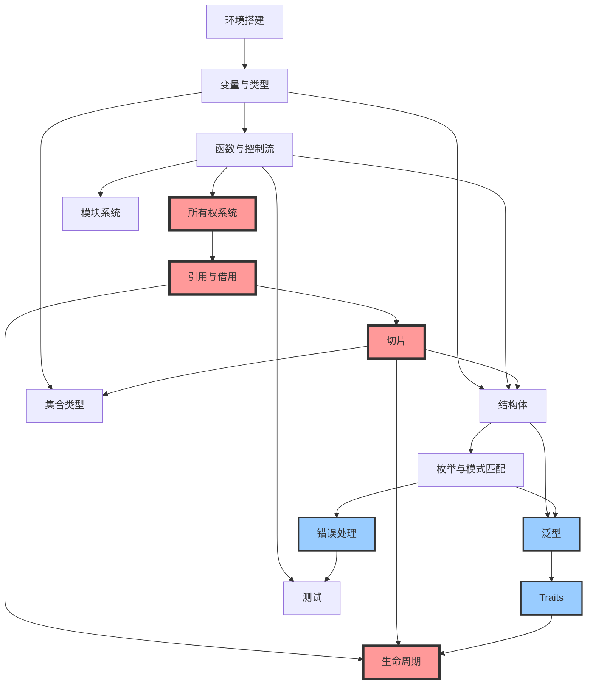
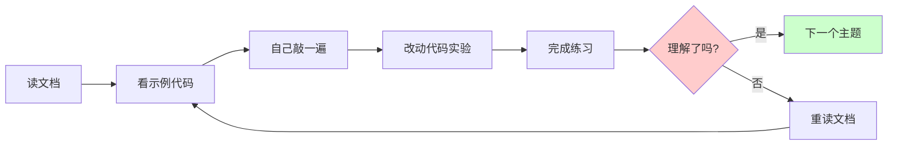

# Rust 基础 (Day 01 - 15)

  
  
  
  

这个目录涵盖了 Rust 编程语言的基础知识，大致对应《Rust 程序设计语言》的前 10-11 章。通过这 15 天的学习，你将掌握 Rust 的核心语法、所有权系统、类型系统以及基本的项目组织方式。

---

## 📚 学习路线图

```mermaid
graph LR
    subgraph 第一周["🌱 第一周：基础语法"]
        D01[Day 01<br/>初识 Rust]
        D02[Day 02<br/>变量与类型]
        D03[Day 03<br/>函数与控制流]
        D04[Day 04<br/>所有权]
        D05[Day 05<br/>引用与借用]
        D06[Day 06<br/>切片]
        D07[Day 07<br/>结构体]
    end
    
    subgraph 第二周["🚀 第二周：进阶特性"]
        D08[Day 08<br/>枚举]
        D09[Day 09<br/>模块系统]
        D10[Day 10<br/>常用集合]
        D11[Day 11<br/>错误处理]
        D12[Day 12<br/>泛型]
        D13[Day 13<br/>特征]
        D14[Day 14<br/>生命周期]
        D15[Day 15<br/>测试]
    end
    
    D01 --> D02 --> D03
    D03 --> D04 --> D05 --> D06
    D06 --> D07 --> D08
    D08 --> D09 --> D10 --> D11
    D11 --> D12 --> D13 --> D14 --> D15
    
    style D04 fill:#ffcccc,stroke:#ff0000,stroke-width:3px
    style D05 fill:#ffcccc,stroke:#ff0000,stroke-width:3px
    style D06 fill:#ffcccc,stroke:#ff0000,stroke-width:3px
    style D14 fill:#ffcccc,stroke:#ff0000,stroke-width:3px
```

> **🔴 核心难点**（红色标记）：所有权、引用与借用、切片、生命周期是 Rust 最独特且最重要的概念，建议重点学习。

---

## 🎯 知识点依赖关系

---

## ⏱️ 学习时间指南

| 难度 | 天数 | 主题 | 建议学习时间 |
|:---:|:---:|:---|:---|
| ⭐ | Day 01 | 初识 Rust | 2-3 小时 |
| ⭐⭐ | Day 02 | 变量与数据类型 | 3-4 小时 |
| ⭐⭐ | Day 03 | 函数与控制流 | 3-4 小时 |
| ⭐⭐⭐⭐ | **Day 04** | **所有权** | **5-6 小时** |
| ⭐⭐⭐⭐ | **Day 05** | **引用与借用** | **5-6 小时** |
| ⭐⭐⭐ | Day 06 | 切片 | 3-4 小时 |
| ⭐⭐ | Day 07 | 结构体 | 3-4 小时 |
| ⭐⭐⭐ | Day 08 | 枚举 | 4-5 小时 |
| ⭐⭐ | Day 09 | 模块系统 | 3-4 小时 |
| ⭐⭐⭐ | Day 10 | 常用集合 | 4-5 小时 |
| ⭐⭐⭐ | Day 11 | 错误处理 | 4-5 小时 |
| ⭐⭐⭐ | Day 12 | 泛型 | 4-5 小时 |
| ⭐⭐⭐⭐ | **Day 13** | **特征** | **5-6 小时** |
| ⭐⭐⭐⭐⭐ | **Day 14** | **生命周期** | **6-8 小时** |
| ⭐⭐ | Day 15 | 测试 | 3-4 小时 |

**总计**：约 **60-75 小时**（建议分 2-3 周完成）

---

## 目录

* **[Day 01: Introduction (初识 Rust)](01.Introduction/README.md)**
  * 环境搭建、安装 Rust
  * Hello World
  * Cargo 包管理器简介
* **[Day 02: Variables and Types (变量与数据类型)](02.VariablesAndTypes/README.md)**
  * 变量与可变性
  * 标量类型 (整型, 浮点型, 布尔型, 字符)
  * 复合类型 (元组, 数组)
* **[Day 03: Functions and Control Flow (函数与控制流)](03.FunctionsAndControlFlow/README.md)**
  * 函数定义、参数与返回值
  * if 表达式
  * 循环 (loop, while, for)
* **[Day 04: Ownership (所有权)](04.Ownership/README.md)**
  * 所有权规则
  * 堆与栈
  * 移动 (Move)、克隆 (Clone) 与 拷贝 (Copy)
* **[Day 05: References and Borrowing (引用与借用)](05.ReferencesAndBorrowing/README.md)**
  * 不可变引用与可变引用
  * 引用规则
  * 悬垂引用
* **[Day 06: Slices (切片)](06.Slices/README.md)**
  * 字符串切片
  * 其他类型的切片
* **[Day 07: Structs (结构体)](07.Structs/README.md)**
  * 定义与实例化结构体
  * 方法与关联函数
* **[Day 08: Enums (枚举)](08.Enums/README.md)**
  * 定义枚举
  * `Option` 枚举
  * `match` 控制流运算符
  * `if let` 语法
* **[Day 09: Modules (模块系统)](09.Modules/README.md)**
  * 包与 Crates
  * 定义模块
  * 路径与 `use` 关键字
  * 可见性 (`pub`)
* **[Day 10: Common Collections (常用集合)](10.CommonCollections/README.md)**
  * Vector (`Vec<T>`)
  * String (`String`)
  * HashMap (`HashMap<K, V>`)
* **[Day 11: Error Handling (错误处理)](11.ErrorHandling/README.md)**
  * `panic!` 与不可恢复错误
  * `Result` 与可恢复错误
  * 错误传播与 `?` 运算符
* **[Day 12: Generics (泛型)](12.Generics/README.md)**
  * 函数、结构体、枚举中的泛型
  * 单态化
* **[Day 13: Traits (特征)](13.Traits/README.md)**
  * 定义与实现 Trait
  * Trait Bounds
  * `impl Trait`
* **[Day 14: Lifetimes (生命周期)](14.Lifetimes/README.md)**
  * 生命周期注解语法
  * 生命周期省略规则
  * 静态生命周期
* **[Day 15: Testing (自动化测试)](15.Testing/README.md)**
  * 编写单元测试
  * `assert!` 宏
  * 运行测试
  * 集成测试

## 学习建议

### 📖 学习策略

1. **顺序学习**：建议按照顺序学习，每一天的内容都建立在前一天的基础上
2. **动手实践**：不仅要阅读文档，还要亲手编写并运行代码
3. **完成练习**：每个主题都包含配套练习，完成练习才能真正掌握
4. **重点关注**：Day 04-06 和 Day 14 是 Rust 的核心和难点，需要反复学习和实践

### 💡 学习技巧

### ⚠️ 常见问题

1. **编译错误太多怎么办？**
   * Rust 编译器的错误信息非常详细，仔细阅读提示
   * 使用 `cargo check` 快速检查语法错误
   * 遇到所有权错误时，画出内存图帮助理解

2. **所有权系统太难理解？**
   * 这是正常的，Rust 最独特的部分需要时间消化
   * 建议多做练习，直到形成肌肉记忆
   * 对比其他语言的内存管理方式来理解

3. **什么时候可以开始做项目？**
   * 完成 Day 1-8 后可以尝试小项目
   * 完成全部 15 天后可以开始中型项目
   * 推荐从 CLI 工具开始

### 📚 额外学习资源

* **[The Rust Book](https://doc.rust-lang.org/book/)**: 官方教材（英文）
* **[Rust 程序设计语言](https://kaisery.github.io/trpl-zh-cn/)**: 官方教材中文版
* **[Rust by Example](https://doc.rust-lang.org/rust-by-example/)**: 通过示例学习
* **[Rustlings](https://github.com/rust-lang/rustlings)**: 交互式练习
* **[Rust 标准库文档](https://doc.rust-lang.org/std/)**: 必备参考

---

## 📊 学习进度追踪

建议在学习过程中使用以下检查清单：

* [ ] Day 01: 环境搭建完成，能成功运行 Hello World
* [ ] Day 02: 理解变量、类型和 Shadowing
* [ ] Day 03: 掌握函数和控制流语法
* [ ] Day 04: **核心** 理解所有权规则
* [ ] Day 05: **核心** 理解引用和借用规则
* [ ] Day 06: **核心** 掌握切片的使用
* [ ] Day 07: 能够定义和使用结构体
* [ ] Day 08: 掌握枚举和模式匹配
* [ ] Day 09: 理解模块系统
* [ ] Day 10: 熟练使用 Vec、String、HashMap
* [ ] Day 11: 掌握错误处理最佳实践
* [ ] Day 12: 理解泛型的使用
* [ ] Day 13: 能够定义和实现 Trait
* [ ] Day 14: **核心** 理解生命周期注解
* [ ] Day 15: 能够编写和运行测试

---

## 🎓 完成后你将掌握

* ✅ Rust 的核心语法和类型系统
* ✅ 所有权、借用和生命周期的深刻理解
* ✅ 能够编写内存安全且高效的 Rust 代码
* ✅ 使用 Cargo 管理项目和依赖
* ✅ 编写单元测试和集成测试
* ✅ 阅读和理解 Rust 官方文档
* ✅ 为学习更高级的 Rust 主题打下坚实基础

## 下一步

完成这 15 天的学习后，建议继续学习：

* **Day 16-30**: 智能指针、并发编程、异步编程
* **Day 31-50**: Web 开发、系统编程、嵌入式开发
* **实战项目**: CLI 工具、Web 服务器、游戏开发

---

**创建日期**: 2026-01-19  
**最后更新**: 2026-01-19
