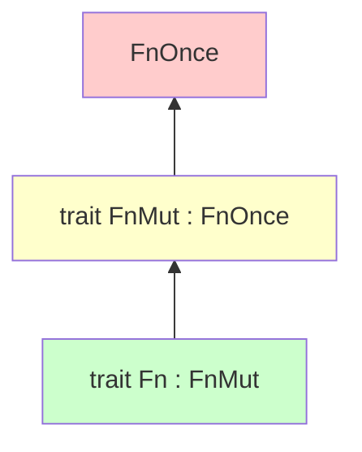

# Day 16: 闭包 (Closures)

## 📝 学习目标

- 理解 **闭包 (Closure)**：可以捕获环境的匿名函数
- 彻底掌握 **`Fn` / `FnMut` / `FnOnce`** 三大 Trait 的区别与层级
- 理解 **`move`** 关键字与所有权转移
- 学会闭包的 **类型推断** 规则

## 🎯 核心概念：函数 + 环境 = 闭包

普通函数 (`fn`) 是孤立的，不仅不能访问函数体外部的变量，甚至连它们的存在都不知道。
**闭包** 则打破了这堵墙，它可以 **捕获** 定义它时所在作用域中的变量。

> **比喻**：普通函数像是一个外包团队，只拿你给的资料干活。闭包像是你的内部员工，可以直接访问公司的内部资源（变量）。

---

## ⚡ 语法：轻量级函数

闭包注重简洁。

```rust
// 普通函数
fn  add_one_v1   (x: i32) -> i32 { x + 1 }

// 闭包（完整版）
let add_one_v2 = |x: i32| -> i32 { x + 1 };

// 闭包（精简版）- 编译器自动推断类型
let add_one_v3 = |x| x + 1;
```

### 类型推断陷阱

闭包的类型是推断出来的，且一旦推断确定，就不能变了。

```rust
let example = |x| x;
let s = example(String::from("hello")); // 推断 x 为 String
// let n = example(5); // ❌ 错误！期望 String，却给了 {integer}
```

---

## 🏗️ 捕获环境的魔法 (The Secret Sauce)

闭包本质上是一个 **匿名结构体**，它里面存了捕获变量的引用或值。
通过实现不同的 Trait，闭包表现出不同的能力。

### Fn Trait 层级图



这意味这：

- 如果一个闭包是 `Fn` (能多次调用，不改环境)，它一定也是 `FnMut` 和 `FnOnce`。
- 如果一个闭包是 `FnOnce` (只能调一次)，它不一定是 `Fn`。

### 详细对比表

| Trait | 含义 | 捕获方式 | 能调用几次? | 例子 |
| :--- | :--- | :--- | :--- | :--- |
| **`FnOnce`** | **Consumes** | 获取所有权 (Move) | **1次** | 此去无回，把自己"吃"掉了 |
| **`FnMut`** | **Mutates** | 可变借用 (`&mut T`) | 多次 | 修改计数器 |
| **`Fn`** | **Reads** | 不可变借用 (`&T`) | 多次 | 只是读取打印 |

### 1. `FnOnce` (吃掉变量)

闭包内部把变量“消耗”掉了（比如 move 到了别处）。

```rust
let x = String::from("hello");
let f = || println!("{}", x); // 仅仅读取，这是 Fn

let x = String::from("hello");
let f = || {
    let y = x; // ⚠️ x 被 move 到了 y，闭包获取了 x 的所有权
    println!("{}", y);
}; 
f(); 
// f(); // ❌ 错误！闭包已经用完即弃了 (Value used after move)
```

### 2. `FnMut` (修改变量)

```rust
let mut count = 0;
let mut f = || count += 1; // 必须是 mut f，因为调用它会改变它的内部状态
f();
f();
println!("{}", count); // 2
```

---

## 🚚 `move` 关键字

默认情况下，闭包是 **懒惰** 的：如果只需要引用，它绝不拿所有权。
但有时我们需要强制闭包拿到所有权，特别是 **多线程** 场景（因为主线程可能先结束，引用就悬垂了）。

```rust
let list = vec![1, 2, 3];

// ❌ 错误：`list` 可能活得没线程久
// std::thread::spawn(|| println!("{:?}", list));

// ✅ 正确：强制把 `list` 的所有权移交给闭包（进而移交给新线程）
std::thread::spawn(move || {
    println!("{:?}", list);
});
// println!("{:?}", list); // ❌ 这里不能再用 list 了
```

---

## 💻 代码实战：带有缓存的 Cacher

假设我们有一个计算量很大的闭包，我们希望它的结果能被缓存，只算一次。

```rust
struct Cacher<T>
where
    T: Fn(u32) -> u32, // 约束：必须能像函数一样调用
{
    calculation: T,
    value: Option<u32>,
}

impl<T> Cacher<T>
where
    T: Fn(u32) -> u32,
{
    fn new(calculation: T) -> Cacher<T> {
        Cacher {
            calculation,
            value: None,
        }
    }

    fn value(&mut self, arg: u32) -> u32 {
        match self.value {
            Some(v) => v,
            None => {
                let v = (self.calculation)(arg); // 调用闭包
                self.value = Some(v);
                v
            }
        }
    }
}
```

---

## 🏋️ 练习题

👉 **[点击这里查看练习题](./exercises/README.md)**

1. **基础闭包**: 编写一个转换字符串大小写的闭包。
2. **捕获计数器**: 使用 `FnMut` 实现计数器。
3. **泛型 Cacher**: 扩展上面的 Cacher，使其支持任意类型的参数和返回值（使用 HashMap）。

---

## 💡 最佳实践

1. **能省则省**: 尽量让编译器推断类型，除非是为了 API 文档的可读性。
2. **优先使用 Fn**: 在设计接受闭包的函数时，参数类型尽量用要求最低的 Trait。
    - 如果只读数据，用 `Fn` （这样用户传 `FnMut` 或 `Fn` 都行）。
    - 抱歉，上面说反了。
    - **API 设计原则**：**对参数宽容，对返回值严苛**。
    - 如果你的函数只需要调用闭包一次，那就声明要 `FnOnce`（这样用户传 `Fn`, `FnMut`, `FnOnce` 主要能调一次的都能用）。
    - 如果你需要反复调用但不修改，声明要 `Fn`。
3. **Move 当心**: 使用 `move` 会一次性拿走所有捕获变量的所有权，注意不要误伤还需要使用的变量。

---

## ⏭️ 下一步

闭包最常见的用途就是和 **迭代器** 配合使用。`map`, `filter`, `fold`... 这些函数式编程的神器在 Rust 中是如何实现的？

下一节: [Day 17: 迭代器 (Iterators)](../17.Iterators/README.md)
