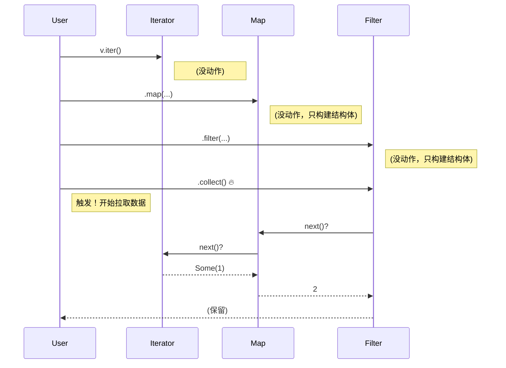

# Day 17: 迭代器 (Iterators)

## 📝 学习目标

- 理解 **Iterator Trait** 及其核心 `next` 方法
- 掌握 **惰性求值 (Lazy Evaluation)** 的工作原理
- 熟练使用 **Iterator Adaptors** (`map`, `filter`) 和 **Consuming Adaptors** (`collect`, `sum`)
- 了解迭代器作为 **零成本抽象** 的性能优势
- 能够手动实现 `Iterator` trait

## 🎯 核心概念：处理序列的流水线

在 Rust 中，迭代器模式是处理序列数据（如数组、Vec）的标准方式。
不同于传统的 `for (int i=0; i<n; i++)` 循环，Rust 的迭代器提供了 **声明式** 的高层抽象，就像一条数据处理流水线。

### 迭代器流水线 (Pipeline)


每个环节（Adapter）都对数据进行处理，最后由消费者（Consumer, 如 `collect`）触发整个流程。

---

## 🛠️ 创建迭代器

有三种主要方式将集合转换为迭代器，对应 Rust 的三种所有权形态：

| 方法 | 返回类型 | 所有权行为 | 适用场景 |
| :--- | :--- | :--- | :--- |
| **`iter()`** | `Iterator<Item = &T>` | **借用** (Immutable Borrow) | 只读遍历，保留原数据 |
| **`iter_mut()`** | `Iterator<Item = &mut T>` | **可变借用** (Mutable Borrow) | 修改原数据 |
| **`into_iter()`** | `Iterator<Item = T>` | **获取所有权** (Move) | 消费数据，原集合不可用 |

```rust
let v = vec![1, 2, 3];
let v_iter = v.iter(); // v 还在
let v_owned_iter = v.into_iter(); // v 被 move 了
```

---

## 💤 惰性求值 (Lazy Evaluation)

Rust 的迭代器是 **惰性** 的。这意味着创建迭代器适配器（如 `map`）**不会发生任何事情**。
只有当你调用消费适配器（如 `collect`, `sum`, `for` 循环）时，数据才会真正开始流动。



---

## 🚀 常用方法

### 1. 迭代器适配器 (Iterator Adaptors)

返回一个新的迭代器，支持链式调用。

- `map`: 转换
- `filter`: 过滤
- `zip`: 两个迭代器合并
- `enumerate`: 附加索引 `(i, val)`
- `take(n)`: 只取前 n 个
- `skip(n)`: 跳过前 n 个

### 2. 消费适配器 (Consuming Adaptors)

调用 `next` 直到结束，返回最终结果。

- `collect`: 转回集合
- `sum`, `product`: 数值计算
- `count`: 计数
- `for_each`: 对每个元素执行副作用
- `find`: 查找第一个符合条件的元素

---

## 💻 代码实战

### 示例 1: 声明式 vs 命令式

求偶数的平方和。

```rust
let v = vec![1, 2, 3, 4, 5];

// 命令式 (Imperative)
let mut sum = 0;
for x in &v {
    if x % 2 == 0 {
        sum += x * x;
    }
}

// 函数式 (Functional) - 更清晰，且性能极佳
let sum: i32 = v.iter()
                .filter(|&x| x % 2 == 0)
                .map(|x| x * x)
                .sum();
```

### 示例 2: 自定义迭代器

只要实现 `next` 方法，你的类型就是迭代器。

```rust
struct Counter {
    count: u32,
}

impl Counter {
    fn new() -> Counter { Counter { count: 0 } }
}

impl Iterator for Counter {
    type Item = u32;

    fn next(&mut self) -> Option<Self::Item> {
        if self.count < 5 {
            self.count += 1;
            Some(self.count)
        } else {
            None
        }
    }
}
```

---

## ⚡ 性能：零成本抽象

你可能会担心：这么多层 `map`, `filter` 函数调用，会不会很慢？
**答案是：不会。**

Rust 编译器（LLVM）会极其聪明地将这些高层抽象优化成极其紧凑的机器码，通常会被展开成与手写汇编相当甚至更快的循环。这就是 **零成本抽象 (Zero-Cost Abstractions)**：
> "What you don't use, you don't pay for. And what you do use, you couldn't hand code any better." - Bjarne Stroustrup

---

## 🏋️ 练习题

👉 **[点击这里查看练习题](./exercises/README.md)**

1. **基础练习**: 使用迭代器重构一个普通的 `for` 循环。
2. **自定义迭代器**: 实现一个生成斐波那契数列的迭代器。
3. **复杂链式**: 结合 `zip`, `map`, `filter` 处理复杂数据。

---

## 💡 最佳实践

1. **优先使用迭代器**: 相比索引循环 (`for i in 0..len`)，迭代器不仅更安全（无越界风险），而且通常更快（省略了边界检查）。
2. **Side Effects**: 如果你只想产生副作用（如打印），使用 `for` 循环比 `.map(...).collect()` 更惯用且更高效（避免了分配无用的集合）。或者使用 `for_each`。
3. **无限迭代器**: 迭代器可以是无限的（如 `0..`），只要你记得用 `take` 截断它。

---

## ⏭️ 下一步

我们已经掌握了 Rust 的大部分核心特性。现在，我们将开始接触 Rust 的独特工具链和生态系统管理。

下一节: [Day 18: Cargo 与 Crates](../18.CargoAndCrates/README.md)
