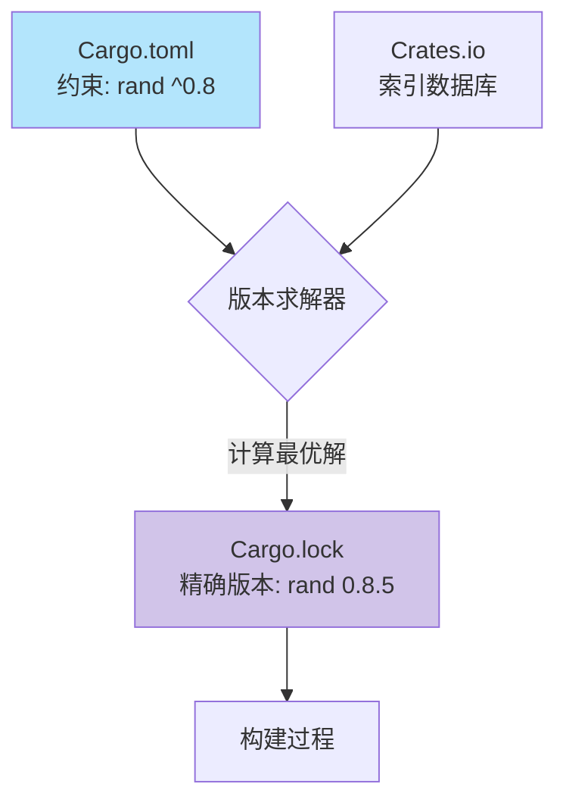

# Day 18: Cargo 进阶与 Crates.io

## 📝 学习目标

- 理解 **Release Profiles** (`dev` vs `release`) 及其配置
- 熟练编写 **文档注释** (`///`) 并通过 `cargo test` 运行文档测试
- 掌握 **Cargo Workspaces** 管理多包项目 (Monorepo)
- 理解 **Cargo.lock** 的作用与 **语义化版本 (SemVer)**
- 了解发布包到 Crates.io 的流程

## 🎯 核心概念：Cargo 不仅仅是构建工具

Cargo 是 Rust 生态系统的统一接口，它身兼数职：构建系统、包管理器、测试运行器、文档生成器和发布工具。

### 依赖解析流程

当你在 `Cargo.toml` 中写下 `rand = "0.8"` 时，Cargo 实际上做了很多工作：



- **Cargo.toml**: 描述你的 **意图** (我要一个兼容 0.8 的版本)。
- **Cargo.lock**: 记录 **事实** (实际构建时用了 0.8.5 版)。**确保可复现构建**。

---

## 🚀 发布配置 (Release Profiles)

Cargo 预设了两种主要的 Profile，分别用于开发和发布。

| Profile | 命令 | `opt-level` (0-3) | 调试信息 | 目标 |
| :--- | :--- | :--- | :--- | :--- |
| **`dev`** | `cargo build` | 0 (无优化) | 包含 | 快速编译，方便 Debug |
| **`release`** | `cargo build --release` | 3 (最大优化) | 不包含 | 运行时极快，二进制小 |

**自定义配置 (`Cargo.toml`)**:

```toml
[profile.dev]
opt-level = 1 # 开发时也稍微优化一下，虽然编译慢点，但运行快点
```

---

## 📚 文档测试 (Documentation Tests)

Rust 允许在文档注释中写代码，并且 Cargo 会去运行它们！这确保了**文档和代码永远同步**。

```rust
/// 将给定的数字加一。
///
/// # Examples
///
/// ```
/// let arg = 5;
/// let answer = my_crate::add_one(arg);
///
/// assert_eq!(6, answer);
/// ```
pub fn add_one(x: i32) -> i32 {
    x + 1
}
```

- **`///`**:用于为接下来的项（函数、结构体）生成文档。
- **`//!`**: 用于为包含它的项（通常是 crate 或 模块）生成文档，通常写在文件开头。
- 运行 `cargo doc --open` 查看生成的网页。

---

## 📦 Cargo Workspaces (工作空间)

当项目变大时，我们通常会把它拆分成多个 crates 放进一个仓库 (Monorepo)。Workspace 允许这些 crates 共享同一个 `Cargo.lock` 和输出目录 `target/`。

### 目录结构可视化

```mermaid
graph TD
    Root[my-project/ <br> Cargo.toml (workspace)] --> Target[target/ <br> (共享构建产物)]
    Root --> Crates[crates/]
    Crates --> Core[core/ <br> Cargo.toml]
    Crates --> Api[api/ <br> Cargo.toml]
    Api -.依赖.-> Core

    style Target fill:#ffccbc
```

**根 `Cargo.toml`**:

```toml
[workspace]
members = [
    "crates/api",
    "crates/core",
]
```

---

## 🏷️ 语义化版本 (SemVer)

Cargo 假定所有的包都遵守 [SemVer](https://semver.org/) 规范。
版本号格式：`Major.Minor.Patch` (主版本.次版本.补丁)

| 部分 | 含义 | 例子 | 兼容性 (Cargo 默认) |
| :--- | :--- | :--- | :--- |
| **Major** | 不兼容的 API 修改 | `1.0.0` -> `2.0.0` | ❌ 不自动升级 (`^1.0` 不含 `2.0`) |
| **Minor** | 向后兼容的新功能 | `1.1.0` -> `1.2.0` | ✅ 允许升级 |
| **Patch** | 向后兼容的 Bug 修复 | `1.1.1` -> `1.1.2` | ✅ 允许升级 |

**特殊情况**: `0.x.x` 版本被视为不稳定，`0.1.0` 和 `0.2.0` 被视为不兼容。

---

## 💻 代码实战：Feature Flags

你可以通过 Feature 开关来控制代码的编译，减小二进制体积或启用实验性功能。

**Cargo.toml**:

```toml
[features]
default = ["std"]
std = []
advanced = []
```

**src/lib.rs**:

```rust
#[cfg(feature = "advanced")]
fn complex_algorithm() {
    println!("Doing heavy math...");
}

fn main() {
    // 只有在开启 advanced feature 时，才编译这行调用
    #[cfg(feature = "advanced")]
    complex_algorithm();
}
```

运行命令：`cargo run --features advanced`

---

## 🏋️ 练习题

👉 **[点击这里查看练习题](./exercises/README.md)**

1. **编写文档测试**: 为你的函数编写文档注释，并确保 `cargo test` 通过。
2. **创建 Workspace**: 模拟一个包含 `core` 和 `cli` 两个包的项目结构。
3. **使用 Feature**: 定义一个特性，控制结构体中的某个字段是否从 API 中暴露。

---

## 💡 最佳实践

1. **二进制提交 .lock**: 如果你开发的是一个可执行程序 (Binary)，务必把 `Cargo.lock` 提交到 Git，确保 CI/CD 行为一致。
2. **库不提交 .lock**: 如果你开发的是一个库 (Library)，通常**不要**提交 `Cargo.lock`，让用户决定最终版本。
3. **CI 检查**: 在 CI 中运行 `cargo fmt`, `cargo clippy`, 和 `cargo doc`。

---

## ⏭️ 下一步

我们已经搞定了构建和包管理。
接下来，我们将进入 Rust 内存管理中比较高级的部分：智能指针。
我们会看看除了引用 (`&`) 之外，还有哪些方式可以指向内存，以及它们解决了什么特定问题。

下一节: [Day 19: 智能指针 - Box](../19.SmartPointers_Box/README.md)
