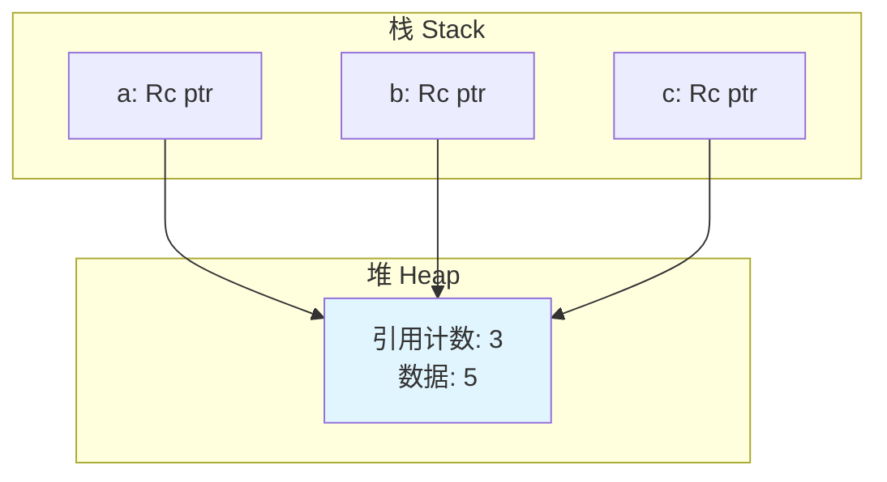
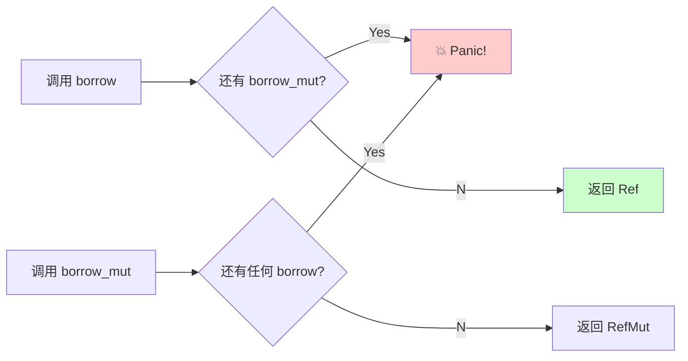

# Day 20: 智能指针 - Rc<T> 与 RefCell<T>

## 📝 学习目标

- 理解 **`Rc<T>`** 如何实现多重所有权 (Shared Ownership)
- 理解 **`RefCell<T>`** 的内部可变性 (Interior Mutability) 模式
- 掌握 **Runtime Borrowing** (运行时借用检查) 机制
- 能够组合使用 **`Rc<RefCell<T>>`** 实现共享可变状态

## 🎯 核心概念：打破规则的工具

Rust 的默认规则（一个所有者，编译时借用检查）非常严格，保证了绝对的安全。
但在某些场景下（如图结构、双向链表、Mock测试），我们需要更灵活的所有权。Rust 提供了 `Rc` 和 `RefCell` 来打破这层限制，但**代价是放弃部分编译时保证**。

### 智能指针矩阵

| 指针类型 | 所有权 | 借用检查时机 | 额外开销 | 适用场景 |
| :--- | :--- | :--- | :--- | :--- |
| **`Box<T>`** | 独占 (1 Owner) | 编译时 | 无 (Zero Cost) | 堆分配，递归类型 |
| **`Rc<T>`** | 共享 (N Owners) | 编译时 | 引用计数 | 多处读取同一数据 |
| **`RefCell<T>`** | 独占 (1 Owner) | **运行时** | 借用计数，Panic | 不可变引用下修改数据 |

---

## 1. Rc<T>: 引用计数 (Reference Counting)

`Rc` 允许一个数据有多个所有者。只有当所有所有者都离开作用域时，数据才会被释放。

### 内存模型



### 使用方法

```rust
use std::rc::Rc;

let a = Rc::new(5);
// Rc::clone 只是增加计数，并不深拷贝数据，非常快
let b = Rc::clone(&a); 
let c = Rc::clone(&a); 
```

**限制**: `Rc<T>` 指向的数据默认是 **不可变** 的。如果它允许修改，那多个所有者同时修改会导致数据竞争。

---

## 2. RefCell<T>: 内部可变性 (Interior Mutability)

通常，`x: &T` 是不可变的。但 `RefCell<T>` 允许你通过不可变引用 `&RefCell<T>` 来修改内部的数据。
这被称为 **内部可变性**。

### 运行时借用检查

- **普通引用**: 违反规则 -> **编译错误** (Compile Error)
- **RefCell**: 违反规则 -> **运行时 Panic**



### 使用方法

```rust
use std::cell::RefCell;

let x = RefCell::new(42);

// 虽然 x 是不可变的，但我们可以获取可变借用
{
    let mut m = x.borrow_mut();
    *m += 1;
} // m 离开作用域，归还借用

println!("x = {:?}", x.borrow()); 
```

---

## 3. 终极组合: Rc<RefCell<T>>

如果你需要一个 **既有多重所有者，又能被修改** 的数据，就把它们结合起来：
`Rc` 外层负责共享，`RefCell` 内层负责修改。

```rust
use std::rc::Rc;
use std::cell::RefCell;

#[derive(Debug)]
struct Node {
    value: i32,
    children: Vec<Rc<RefCell<Node>>>, // 子节点被共享且可变
}

fn main() {
    let leaf = Rc::new(RefCell::new(Node { value: 0, children: vec![] }));
    let branch = Rc::new(RefCell::new(Node { value: 10, children: vec![Rc::clone(&leaf)] }));

    // 修改叶子节点
    leaf.borrow_mut().value = 5;

    println!("branch: {:?}", branch);
}
```

---

## 💻 代码实战

让两个列表共享同一个尾部。

```rust
use std::rc::Rc;

#[derive(Debug)]
enum List {
    Cons(i32, Rc<List>),
    Nil,
}

use crate::List::{Cons, Nil};

fn main() {
    // 5 -> 10 -> Nil
    let a = Rc::new(Cons(5, Rc::new(Cons(10, Rc::new(Nil)))));
    
    // 3 -> (a)
    let b = Cons(3, Rc::clone(&a));
    // 4 -> (a)
    let c = Cons(4, Rc::clone(&a)); 
    
    // b 和 c 共享 a
    println!("List b: {:?}", b);
    println!("List c: {:?}", c);
}
```

---

## 🏋️ 练习题

👉 **[点击这里查看练习题](./exercises/README.md)**

1. **引用计数**: 创建共享列表并打印引用计数 (`Rc::strong_count`)。
2. **内部可变性**: 使用 `RefCell` 实现一个 Mock 对象，记录函数调用的参数。
3. **共享可变**: 构造一个简单的图结构，修改其中一个节点，验证所有指向它的引用都能看到修改。

---

## 💡 最佳实践

1. **慎用 RefCell**: 只有在编译器无法推断借用规则，但你确定代码是安全的时候才使用。
2. **避免 Panic**: 在生产环境中，考虑使用 `try_borrow` 和 `try_borrow_mut`，它们返回 `Result` 而不是直接 Panic。
3. **注意循环引用**: `Rc` 指向 `Rc` 容易形成环，导致内存泄漏（两个引用计数永远不降为 0）。下一节我们会讲 `Weak` 指针来解决这个问题。

---

## ⏭️ 下一步

如果两个 `Rc` 互相指向对方，计数器永远不会归零，内存永远不会释放。这就是 **内存泄漏**。
为了解决这个问题，Rust 引入了弱引用 (`Weak`)。

下一节: [Day 21: 引用循环与内存泄漏 (Reference Cycles)](../21.ReferenceCycles/README.md)
