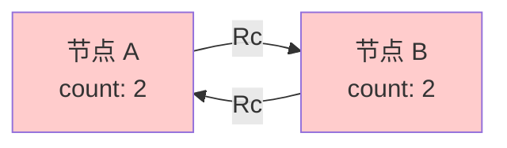
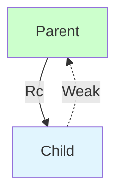

# Day 21: 引用循环与内存泄漏 (Reference Cycles)

## 📝 学习目标

- 理解 **引用循环 (Reference Cycle)** 是如何产生的
- 掌握 **内存泄漏 (Memory Leak)** 的原因
- 熟练使用 **`Weak<T>`** (弱引用) 打破循环
- 能够构建父子双向引用的 **树形结构**

## 🎯 核心概念：Rc 的阿喀琉斯之踵

Rust 的内存安全机制非常强大，但它并不保证 **绝对没有内存泄漏**。
当使用 `Rc<T>` 和 `RefCell<T>` 时，如果两个对象互相引用，且都是强引用 (Strong Reference)，就会形成死锁般的引用循环，导致内存永远无法释放。

### 引用循环可视化



1. A 指向 B，B 的计数为 1。
2. B 指向 A，A 的计数为 1。
3. 外部变量 `a` 指向 A，A 计数 2。
4. 外部变量 `b` 指向 B，B 计数 2。
5. `main` 结束，`a` 和 `b` 离开作用域，A 和 B 计数各减 1，变为 1。
6. **结果**：A 和 B 互相引用，计数永远为 1，永远不会被回收！

---

## 🛡️ 解决方案：Weak<T>

为了打破循环，我们需要一种 "不持有所有权" 的引用，这就是 **`Weak<T>`**。

### 强引用 vs 弱引用

| 特性 | `Rc<T>` (强引用) | `Weak<T>` (弱引用) |
| :--- | :--- | :--- |
| **增加计数** | `strong_count` | `weak_count` |
| **所有权** | 拥有数据 | **不**拥有数据 |
| **生命周期** | 计数归零才清理 | 不影响清理 |
| **访问方式** | 直接访问 | 必须调用 `upgrade()` |
| **比喻** | 牵着气球的线 (线在球在) | 看着气球的人 (人走球不一定走) |

### 访问弱引用

因为 `Weak<T>` 指向的值可能已经被释放了，所以在使用前必须通过 `.upgrade()` 升级。它返回 `Option<Rc<T>>`。

```rust
use std::rc::{Rc, Weak};

let weak: Weak<i32> = ...;

match weak.upgrade() {
    Some(rc_val) => println!("值还在: {}", rc_val),
    None => println!("值已经被释放了"),
}
```

---

## 💻 代码实战：树形结构

最经典的引用循环场景是 **树 (Tree)**：父节点拥有子节点，子节点也想知道父节点是谁。

- Parent -> Child: **Strong** (父在子在)
- Child -> Parent: **Weak** (子在父不一定在，防止循环)



```rust
use std::rc::{Rc, Weak};
use std::cell::RefCell;

#[derive(Debug)]
struct Node {
    value: i32,
    // 子节点列表：父节点拥有子节点 (Vec<Rc>)
    children: RefCell<Vec<Rc<Node>>>,
    // 父节点指针：子节点弱引用父节点 (Weak)
    parent: RefCell<Weak<Node>>, 
}

fn main() {
    // 1. 创建叶子 (Leaf)
    let leaf = Rc::new(Node {
        value: 3,
        parent: RefCell::new(Weak::new()), // 初始没有父节点
        children: RefCell::new(vec![]),
    });

    println!("leaf strong = {}, weak = {}", Rc::strong_count(&leaf), Rc::weak_count(&leaf));

    {
        // 2. 创建树枝 (Branch)
        let branch = Rc::new(Node {
            value: 5,
            children: RefCell::new(vec![Rc::clone(&leaf)]), // Branch 拥有 Leaf
            parent: RefCell::new(Weak::new()),
        });

        // 3. 建立反向连接：Leaf 指向 Branch
        *leaf.parent.borrow_mut() = Rc::downgrade(&branch); // 这里使用 downgrade 创建 Weak

        println!("branch strong = {}, weak = {}", Rc::strong_count(&branch), Rc::weak_count(&branch));
        
        // 尝试访问父节点
        println!("leaf parent: {:?}", leaf.parent.borrow().upgrade());
    } // branch 离开作用域，被销毁

    // 4. branch 死后，leaf 还在，但它的 parent 已经空了
    println!("leaf parent dead: {:?}", leaf.parent.borrow().upgrade());
}
```

---

## 🏋️ 练习题

👉 **[点击这里查看练习题](./exercises/README.md)**

1. **制造泄漏**: 故意编写一个双向链表 A <-> B (使用 `Rc`)，并验证内存没有被释放 (strong_count 不归零)。
2. **修复泄漏**: 使用 `Weak` 修复上述代码。
3. **图结构**: 实现一个简单的有向图，节点间可能有环，思考如果只用 `Rc` 会有什么问题。

---

## 💡 最佳实践

1. **层级关系**: 在父子层级关系中，通常 **父持子(Strong)，子指父(Weak)**。
2. **检查必要性**: 只有在确实需要双向引用时才引入 `Weak`，否则单向引用（只有 `children`）通常更简单安全。
3. **Upgrade 检查**: 永远不要假设 `Weak` 指针有效，始终处理 `upgrade()` 返回 `None` 的情况。

---

## ⏭️ 下一步

智能指针及其潜在的内存问题我们已经讨论完了。
接下来的话题将进入 Rust 的另一个杀手级特性：**并发编程**。
我们将学习如何安全地使用线程，拥抱“Fearless Concurrency”。

下一节: [Day 22: 线程 (Threads)](../22.Threads/README.md)
