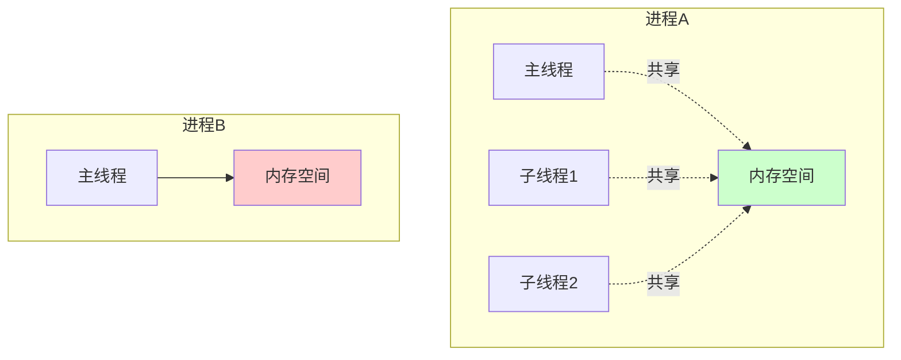
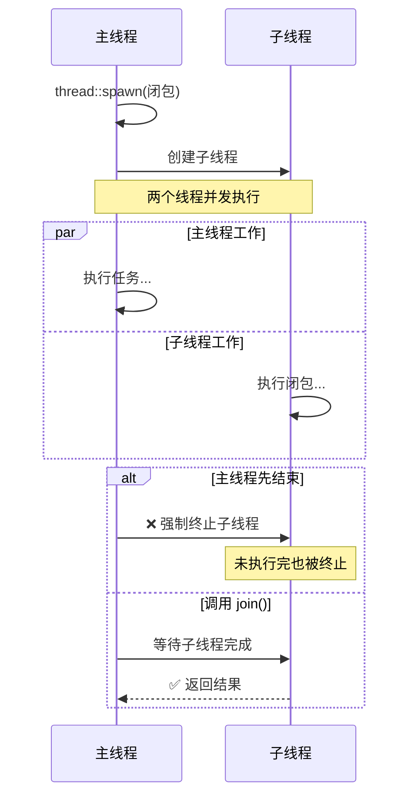

# Day 22: 并发编程 - 线程 (Threads)

<p align="center">
  
  
  
</p>

Rust 中的并发编程非常安全，因为 Rust 的所有权和类型系统会在**编译时**捕获许多并发错误（如数据竞争）。这让 Rust 成为编写高性能并发程序的理想语言。

---

## 📝 学习目标

- 理解线程的基本概念和工作原理
- 掌握使用 `std::thread::spawn` 创建和管理线程
- 学会使用 `Join Handle` 等待线程完成
- 理解 `move` 闭包在多线程中的作用
- 掌握线程安全的数据传递方式
- 了解线程的性能开销和使用场景

---

## 🎯 为什么要学这个

并发编程是现代应用程序的核心：

1. **充分利用硬件**：现代 CPU 都是多核的，单线程程序无法充分利用硬件性能
2. **提升响应性**：将耗时任务放到后台线程，主线程可以继续响应用户
3. **提高吞吐量**：并行处理多个请求（如 Web 服务器）
4. **Rust 的优势**：编译时保证线程安全，没有数据竞争！

**与其他语言对比**：

- **C/C++**：性能高但容易出现数据竞争、死锁等问题
- **Go**：goroutine 轻量但运行时开销大
- **Rust**：零成本抽象 + 编译时安全保证 = 最佳选择！

---

## 📖 核心概念

### 1. 线程 vs 进程



| 特性 | 进程 (Process) | 线程 (Thread) |
|:---|:---|:---|
| **内存空间** | 独立 | 共享同一进程的内存 |
| **开销** | 重（MB 级） | 轻（KB 级） |
| **通信** | IPC（慢） | 共享内存（快但需要同步） |
| **安全性** | 隔离性好 | 需要手动保证线程安全 |

### 2. 线程的生命周期



---

## 💻 代码示例

### 示例 1: 基本线程创建

```rust
use std::thread;
use std::time::Duration;

fn main() {
    // 创建子线程
    let handle = thread::spawn(|| {
        for i in 1..10 {
            println!("🧵 子线程: number {}", i);
            thread::sleep(Duration::from_millis(1));
        }
    });

    // 主线程继续执行
    for i in 1..5 {
        println!("🚀 主线程: number {}", i);
        thread::sleep(Duration::from_millis(1));
    }

    // 等待子线程完成（重要！）
    handle.join().unwrap();
    
    println!("✅ 所有线程完成");
}
```

### 示例 2: move 闭包 - 转移所有权

```rust
use std::thread;

fn main() {
    let v = vec![1, 2, 3];

    // ✅ 使用 move 强制转移所有权
    let handle = thread::spawn(move || {
        println!("📦 vector: {:?}", v);
    });

    handle.join().unwrap();
}
```

### 示例 3: 使用 JoinHandle 获取返回值

```rust
use std::thread;

fn main() {
    let handle = thread::spawn(|| {
        std::thread::sleep(std::time::Duration::from_secs(1));
        42 // 返回计算结果
    });

    println!("⏳ 等待计算结果...");
    let result = handle.join().unwrap();
    println!("✨ 计算结果: {}", result);
}
```

---

## 🤔 常见问题 FAQ

### Q1: Rust 线程 vs Go goroutine vs C++ thread？

| 特性 | Rust std::thread | Go goroutine | C++ std::thread |
|:---|:---|:---|:---|
| **模型** | 1:1 OS 线程 | M:N 绿色线程 | 1:1 OS 线程 |
| **开销** | ~2MB | ~2KB | ~2MB |
| **调度** | OS 调度 | Go 运行时调度 | OS 调度 |
| **安全性** | 编译时保证 | 运行时检查 | 无保证 |

### Q2: join() 会阻塞吗？

**是的！** `join()` 会阻塞当前线程直到目标线程结束。

---

## 💡 最佳实践

1. **始终join()**: 确保子线程完成或使用其他同步机制
2. **线程命名**: 使用 `Builder::new().name()` 便于调试
3. **避免过度线程化**: 线程不是免费的，每个约占 2MB 栈空间

---

## 🔗 扩展阅读

- [Rust Book: Fearless Concurrency](https://doc.rust-lang.org/book/ch16-00-concurrency.html)
- [std::thread 文档](https://doc.rust-lang.org/std/thread/)

---

## ⏭️ 下一步

**下一节**: [Day 23: 消息传递 (Message Passing)](../23.MessagePassing/README.md)
