# Day 22: 并发编程 - 线程 (Threads)

## 📝 学习目标

- 理解 **1:1 线程模型** 与 OS 线程的关系
- 掌握 **`thread::spawn`** 创建线程与 **`join`** 等待
- 深刻理解 **`move`** 闭包在多线程所有权转移中的作用
- 掌握 **`thread::scope`** (Scoped Threads) —— 借用局部变量的神器
- 学会使用 **Builder** 模式配置线程（如命名、栈大小）

## 🎯 核心概念：Fearless Concurrency

Rust 的并发编程被称为 "无畏并发" (Fearless Concurrency)。
这意味着许多在其他语言中会导致运行时崩溃或数据竞争的错误（如多线程同时读写无锁内存），在 Rust 中是 **编译时错误**。

### 线程模型 Gantt 图

```mermaid
gantt
    title 并行执行示意图
    dateFormat X
    axisFormat %s
    
    section 主线程
    Spawn T1       : 0, 1
    Do Work        : 1, 3
    Join T1        : 3, 5
    
    section 子线程 T1
    Start          : 1, 1
    Heavy Task     : 1, 4
    End            : 4, 4
```



主线程和子线程是 **同时 (Parallel)** 运行的，直到主线程调用 `.join()` 等待子线程结束。

---

## 🛠️ 基本使用

### 1. `thread::spawn`与 `join`

最基础的用法。注意 `spawn` 返回一个 `JoinHandle`。

```rust
use std::thread;
use std::time::Duration;

fn main() {
    let handle = thread::spawn(|| {
        for i in 1..10 {
            println!("hi number {} from the spawned thread!", i);
            thread::sleep(Duration::from_millis(1));
        }
    }); // 线程在这里开始运行

    for i in 1..5 {
        println!("hi number {} from the main thread!", i);
        thread::sleep(Duration::from_millis(1));
    }

    handle.join().unwrap(); // 阻塞主线程，直到子线程结束
}
```

### 2. `move` 闭包：所有权转移

默认情况下，线程闭包不能借用外部环境的变量（因为编译器无法保证外部变量活得比线程久）。
必须使用 `move` 强制转移所有权。


```rust
let v = vec![1, 2, 3];

// ❌ 编译错误：v 可能在线程结束前被释放
// thread::spawn(|| println!("{:?}", v));

// ✅ 正确：把 v 的所有权移交给线程
thread::spawn(move || println!("{:?}", v));
```

---

## 🔥 现代利器：Scoped Threads (`thread::scope`)

在 Rust 1.63 之前，想在线程里 **借用** (而不是 move) 局部变量非常麻烦（通常要用 `Arc`）。
现在我们有了 `std::thread::scope`。它保证在作用域结束前，里面创建的所有线程都会被 join。

**这就是所谓的 "Scoped Threads"：编译器知道这些线程绝不会活得比作用域久，所以可以安全地借用局部变量！**

```rust
use std::thread;

fn main() {
    let v = vec![1, 2, 3]; // 局部变量

    thread::scope(|s| {
        // 借用 v，不需要 move！
        s.spawn(|| {
            println!("Thread 1: {:?}", v); 
        });

        s.spawn(|| {
            println!("Thread 2: len = {}", v.len());
        });
    }); // <--- 这里会隐式 join 所有线程，主线程会在这里阻塞等待

    println!("All threads finished, v is still here: {:?}", v);
}
```

---

## ⚙️ 进阶配置：Builder API

如果你需要更细粒度的控制（比如给线程起名字，方便 Panic 时调试），可以使用 `Builder`。

```rust
use std::thread;

let handle = thread::Builder::new()
    .name("worker-1".into()) // 命名线程
    .stack_size(32 * 1024)   // 设置栈大小 32KB
    .spawn(|| {
        println!("I am a customized thread!");
    })
    .unwrap();

handle.join().unwrap();
```

---

## 🏋️ 练习题

👉 **[点击这里查看练习题](./exercises/README.md)**

1. **基本线程**: 创建 10 个线程，每个打印一个数字。
2. **Scoped Threads**: 使用 `thread::scope` 并发计算切片的两半部分之和。
3. **Move 语义**: 尝试在不使用 `move` 的情况下将 `String` 传入 `spawn` 线程，观察报错，并修复它。

---

## 💡 最佳实践

1. **优先用 Scope**: 如果你的线程不需要活得比函数久，优先使用 `thread::scope`，它比 `Arc` 更快且更易读。
2. **避免 Detach**: 虽然可以不调用 `join` 让线程后台运行 (Detach)，但这通常会导致资源难以管理和程序退出时的未定义行为。
3. **配置名称**: 给线程起个名字，这是生产环境中出了 Bug 能快速定位的关键。

---

## ⏭️ 下一步

现在我们能在线程间并行执行代码了，但如果线程之间需要 **通过发消息** 来交流怎么办？（Go 语言的哲学：不要通过共享内存来通信，要通过通信来共享内存）。

下一节: [Day 23: 消息传递 (Message Passing)](../23.MessagePassing/README.md)
