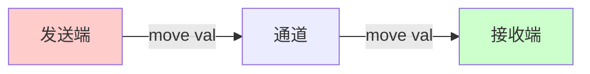

# Day 23: 并发编程 - 消息传递 (Message Passing)

## 📝 学习目标

- 掌握 **Message Passing** 并发模型 ("Do not communicate by sharing memory...")
- 理解 **mpsc** (多生产者单消费者) 架构
- 掌握 **所有权转移** 在通道中的作用
- 区分 **非阻塞 (Asynchronous)** 与 **阻塞 (Synchronous)** 通道

## 🎯 核心概念：以通信共享内存

与 "线程 A 和线程 B 同时修改变量 X" 不同，Rust 提倡 "线程 A 把数据 X 发送给线程 B"。
一旦发送，线程 A 就失去了对 X 的所有权，从而杜绝了数据竞争。

> "Do not communicate by sharing memory; instead, share memory by communicating." - Go Proverb

### MPSC 模型流水线

Rust 标准库的通道是 **Multiple Producer, Single Consumer** (多生产者，单消费者)。

```mermaid
graph LR
    Producer1[线程 A (Tx)] -->|发送消息| Channel(通道)
    Producer2[线程 B (Tx1)] -->|发送消息| Channel
    Channel -->|接收消息| Consumer[主线程 (Rx)]
    
    style Channel fill:#e1f5fe
    style Consumer fill:#fff9c4
```

---

## 🛠️ 基本使用：mpsc::channel

这是一个 **异步、无限缓冲** 的通道。发送永远不会阻塞（除非内存耗尽），接收会阻塞直到有数据。

### 所有权转移图解 (The Transfer)

当你调用 `send(val)` 时，`val` 的所有权被移交给了通道（最终移交给接收者）。



```rust
use std::sync::mpsc;
use std::thread;

fn main() {
    let (tx, rx) = mpsc::channel();

    thread::spawn(move || {
        let val = String::from("hi");
        println!("Sending: {}", val);
        tx.send(val).unwrap(); 
        // println!("val is {}", val); // ❌ 错误：val 的所有权已经没了！
    });

    let received = rx.recv().unwrap(); // 阻塞等待
    println!("Got: {}", received);
}
```

---

## ⚡ 两种通道类型对比

Rust 提供了两种通道：

| 类型 | 构造函数 | 缓冲区大小 | 发送行为 `send()` | 适用场景 |
| :--- | :--- | :--- | :--- | :--- |
| **异步 (Asynchronous)** | `channel()` | 无限 | **非阻塞** (立即返回) | 生产者不应等待，或者生产速度慢于消费速度 |
| **同步 (Synchronous)** | `sync_channel(N)` | 固定大小 N | **阻塞** (直到缓冲区有空位) | 需要背压 (Backpressure)，限制生产速度 |

### 同步通道示例 (Backpressure)

```rust
use std::sync::mpsc;
use std::thread;
use std::time::Duration;

fn main() {
    // 缓冲区只有 1。如果里面已经着了 1 个消息，再发就会阻塞。
    let (tx, rx) = mpsc::sync_channel(1);

    thread::spawn(move || {
        println!("发送 1...");
        tx.send(1).unwrap(); // 成功，缓冲 1/1
        
        println!("发送 2...");
        tx.send(2).unwrap(); // 阻塞！直到接收端拿走了 1
        println!("2 发送成功！");
    });

    thread::sleep(Duration::from_secs(2));
    println!("接收: {}", rx.recv().unwrap()); // 拿走 1，发送端解除阻塞
}
```

---

## 🔄 发送多个值 (迭代器模式)

接收端 `Rx` 实现了 `Iterator` trait，可以像遍历数组一样遍历消息，直到通道关闭。

```rust
let (tx, rx) = mpsc::channel();
let tx1 = tx.clone(); // 克隆发送端，支持多生产者

thread::spawn(move || {
    let vals = vec!["A", "B", "C"];
    for v in vals {
        tx1.send(v).unwrap();
        thread::sleep(Duration::from_millis(1));
    }
}); // 线程结束，tx1 销毁

thread::spawn(move || {
    let vals = vec!["D", "E", "F"];
    for v in vals {
        tx.send(v).unwrap();
        thread::sleep(Duration::from_millis(1));
    }
}); // 线程结束，tx 销毁

// 只要还有 tx 活着，迭代器就不会结束
// 当所有 tx 都销毁且 buffer 空了，迭代结束
for received in rx {
    println!("Got: {}", received);
}
```

---

## 🏋️ 练习题

👉 **[点击这里查看练习题](./exercises/README.md)**

1. **多线程聊天室**: 创建 3 个线程模拟用户，向主线程发送消息，主线程打印出来。
2. **工作池 (Worker Pool)**: 创建一个任务通道，分发给 4 个 Worker 线程执行。
3. **同步限制**: 使用 `sync_channel` 模拟一个生产速度远快于消费速度的场景，观察发送端的阻塞行为。

---

## 💡 最佳实践

1. **克隆发送端**: `tx` 可以无限克隆 (`mpsc`)，但 `rx` 只能有一个。
2. **错误处理**: `send` 会返回 `Result`。如果接收端 `rx` 已经被销毁了，`send` 会报错。利用这一点可以优雅退出生产者线程。
3. **所有权**: 发送的消息必须实现了 `Send` trait（几乎所有类型都是）。

---

## ⏭️ 下一步

如果多个线程必须 **同时访问** 同一个内存位置（而不是传递它），我们该怎么办？这就需要锁（Locks）。

下一节: [Day 24: 共享状态并发 (Shared State)](../24.SharedState/README.md)
