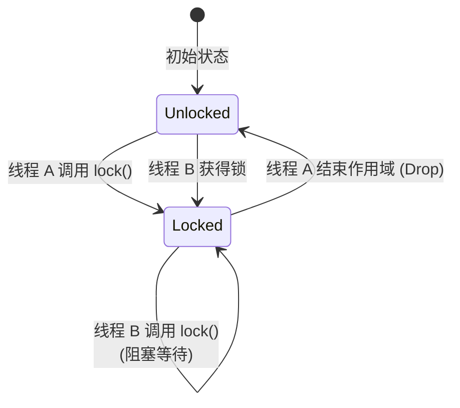
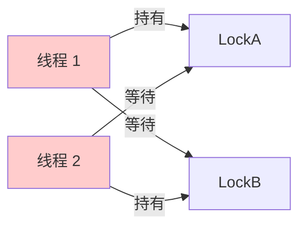

# Day 24: 并发编程 - 共享状态 (Shared State)

## 📝 学习目标

- 理解 **共享状态** 并发模型 ("Shared Memory")
- 掌握 **`Mutex<T>`** (互斥锁) 的使用与原理
- 掌握 **`Arc<T>`** (原子引用计数) 在多线程中的作用
- 理解 **死锁 (Deadlock)** 及其成因
- 区分 `Rc`/`RefCell` 与 `Arc`/`Mutex`

## 🎯 核心概念：抢麦克风

如果说 Message Passing 是传纸条，那 Shared State 就是一群人抢同一个麦克风。
**规则**：

1. 想说话必须先拿到麦克风（获取锁 `lock`）。
2. 同一时间只能有一个人拿麦克风（互斥 `Mutex`）。
3. 说完了必须把麦克风放下（释放锁 `drop`）。

### Mutex 状态机



---

## 1. Mutex<T>: 互斥锁

`Mutex` (Mutual Exclusion) 提供了一种 **内部可变性** (Interior Mutability)，就像 `RefCell` 一样，允许你在不可变引用的情况下修改内部数据。

- **`lock()`**: 阻塞当前线程，直到获取锁。
- **`unwrap()`**: 如果另一个线程在持有锁时 Panic 了，锁就会变脏 (Poisoned)。`unwrap` 此时会 Panic。通常我们直接 `unwrap`，因为一旦数据污染，程序也没法跑了。
- **`MutexGuard`**: `lock()` 返回的智能指针。当它离开作用域 (Drop) 时，锁会自动释放。

```rust
use std::sync::Mutex;

fn main() {
    let m = Mutex::new(5);

    {
        // 获取锁，block 直到拿到为止
        let mut num = m.lock().unwrap();
        *num = 6;
    } // 离开作用域，num 被 drop，锁自动释放

    println!("m = {:?}", m);
}
```

---

## 2. Arc<T>: 多线程的所有权

要在多个线程间共享 `Mutex`，我们需要多重所有权。

- `Rc<T>`: **非**线程安全。它的计数器更新不是原子的 (Atomic)。
- `Arc<T>`: **A**tomic **R**eference **C**ounting。线程安全，但性能稍低。

### 内存布局：线程间的共享

```mermaid
graph TD
    subgraph Thread1 [线程 1]
        A1[Arc ptr]
    end
    subgraph Thread2 [线程 2]
        A2[Arc ptr]
    end
    
    subgraph Heap [堆内存]
        Data[Mutex <br> (包含数据)]
    end
    
    A1 -->|共享| Data
    A2 -->|共享| Data
    
    style Data fill:#e1f5fe
```

### 为什么不能用 Rc?

如果在多线程中使用 `Rc`，两个线程同时增加引用计数 (`count += 1`)，可能会因为 CPU 缓存竞争导致计数错误，最终导致内存泄漏或 Double Free。`Arc` 使用 CPU 的原子指令保证了计数的准确性。

---

## 3. 标准组合：Arc<Mutex<T>>

这是 Rust 并发编程中最常见的模式，相当于线程安全版的 `Rc<RefCell<T>>`。

```rust
use std::sync::{Arc, Mutex};
use std::thread;

fn main() {
    // 1. 创建共享数据：Arc(Mutex(数据))
    let counter = Arc::new(Mutex::new(0));
    let mut handles = vec![];

    for _ in 0..10 {
        // 2. 克隆 Arc，让新线程拥有所有权
        let counter = Arc::clone(&counter);
        
        let handle = thread::spawn(move || {
            // 3.获取锁并修改
            let mut num = counter.lock().unwrap();
            *num += 1;
        });
        handles.push(handle);
    }

    for handle in handles {
        handle.join().unwrap();
    }

    // 主线程读取最终结果
    println!("Result: {}", *counter.lock().unwrap());
}
```

---

## ☠️ 死锁 (Deadlock)

Rust 保证内存安全（不会发生数据竞争），但**不保证避免死锁**。
如果两个线程互相等待对方释放锁，程序就会卡死。



**避免策略**:

1. **顺序加锁**: 总是以相同的顺序获取锁（例如先 A 后 B）。
2. **缩小锁范围**: 尽量缩短持有锁的时间。

---

## ⚡ 智能指针对比表

| 单线程 (非线程安全) | 多线程 (线程安全) | 功能 |
| :--- | :--- | :--- |
| `Rc<T>` | **`Arc<T>`** | 共享所有权 (只读) |
| `RefCell<T>` | **`Mutex<T>`** | 内部可变性 (互斥修改) |
| `Rc<RefCell<T>>` | **`Arc<Mutex<T>>`** | 共享可变状态 |

---

## 🏋️ 练习题

👉 **[点击这里查看练习题](./exercises/README.md)**

1. **多线程计数器**: 修复提供的代码，使其能正确地在多线程中计数。
2. **死锁模拟**: 编写一个必然死锁的程序，并尝试修复它（调整加锁顺序）。
3. **读写锁**: 了解 `RwLock<T>`，它允许多个读者或一个写者。尝试用它替换 `Mutex`。

---

## 💡 最佳实践

1. **锁的粒度**: 锁保护的数据越少越好，持有锁的时间越短越好。
2. **RwLock**: 如果读操作远多于写操作，使用 `RwLock<T>` 性能更好。
3. **Send / Sync**:
    - `Send`: 类型的所有权可以在线程间移动。
    - `Sync`: 类型的引用 (`&T`) 可以被多个线程共享。
    - `Mutex<T>` 是 `Sync` 的，只要 `T` 是 `Send` 的。

---

## ⏭️ 下一步

我们学习了线程、通道和锁。如果我们需要在异步编程（Async/Await）场景下并发呢？
在进入异步之前，我们先补充一个重要话题：**Trait 对象与面向对象设计模式**。

下一节: [Day 25: 面向对象特性 (OO Features)](../25.OOFeatures/README.md)
