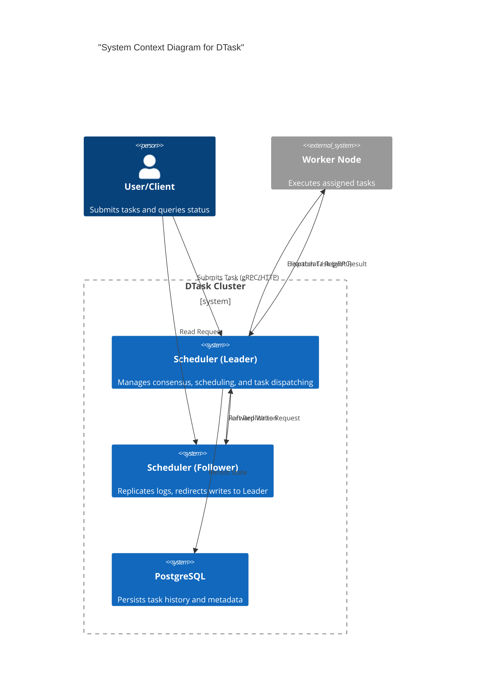
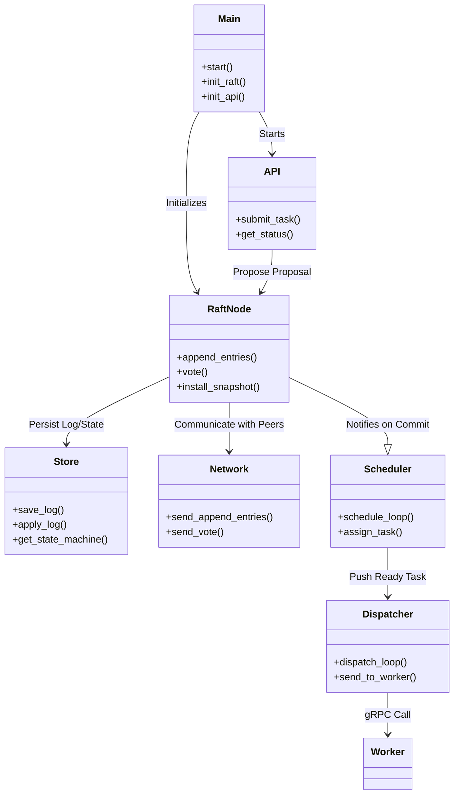
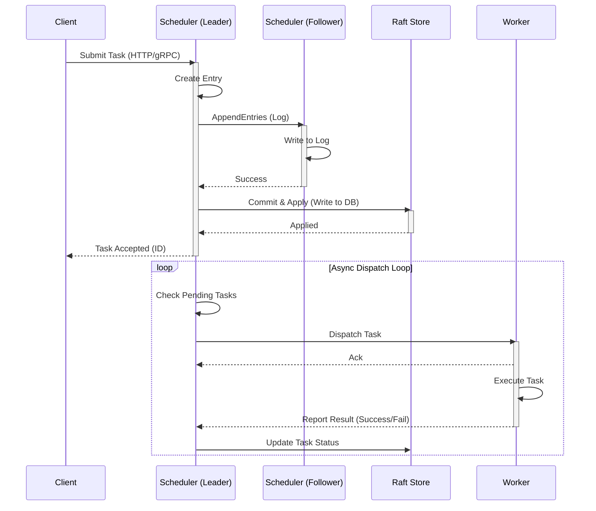
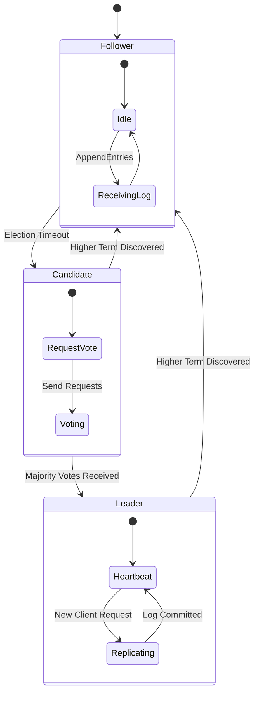
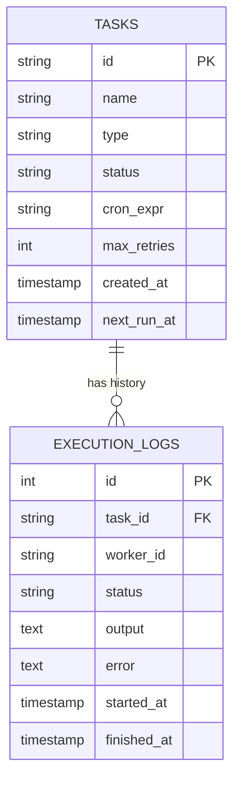

# DTask System Architecture

This document provides a visual overview of the DTask distributed task scheduling system architecture, including high-level design, component interactions, and state transitions.

## 1. System Architecture (C4 Context)

The DTask system consists of a cluster of Scheduler nodes (managing state via Raft) and Worker nodes (executing tasks).

## 2. Component Relationship Diagram

This diagram shows how the internal Rust modules interact within a single Scheduler node.

## 3. Task Execution Sequence

The lifecycle of a task from submission to completion.

## 4. Raft State Machine

The states a DTask node can be in regarding the consensus protocol.

## 5. Entity Relationship (Database)

